# 薄刃 VIBE 課程知識庫
- 講師：郭博仁醫師（Po-Jan Kuo, DDS, PhD）
- 日期：2025-10-25
- 影片數量：3 支（Day 3 Lectures 8-10）
- 總時長：332 分鐘
- 主題概覽：VIBE (Vestibular Incision subperiosteal tunnel technique with Bone and tissue Enhancement) — 從 soft tissue loss 的病理基礎，到 CTG 設計原則，再到 VIBE 手術核心操作與進階應用
- 關鍵字：#VIBE #PFT-tunnel #SCS-suture #root-coverage #CTG #soft-tissue-management #RT2 #RT3 #keratinized-tissue #recession

---

## 模組一：理論基礎 — Soft Tissue Loss 的病理與原則

### 段落 1：課程導言與學習目標 {影片 Part 1 00:00-05:00}

**主題標籤：** #課程宗旨 #protocol #臨床實踐 #教學開發

**相關概念：** 前置→理論鋪墊; 延伸→完整 VIBE 技術; 跨課程→軟組織管理原則

**截圖：**
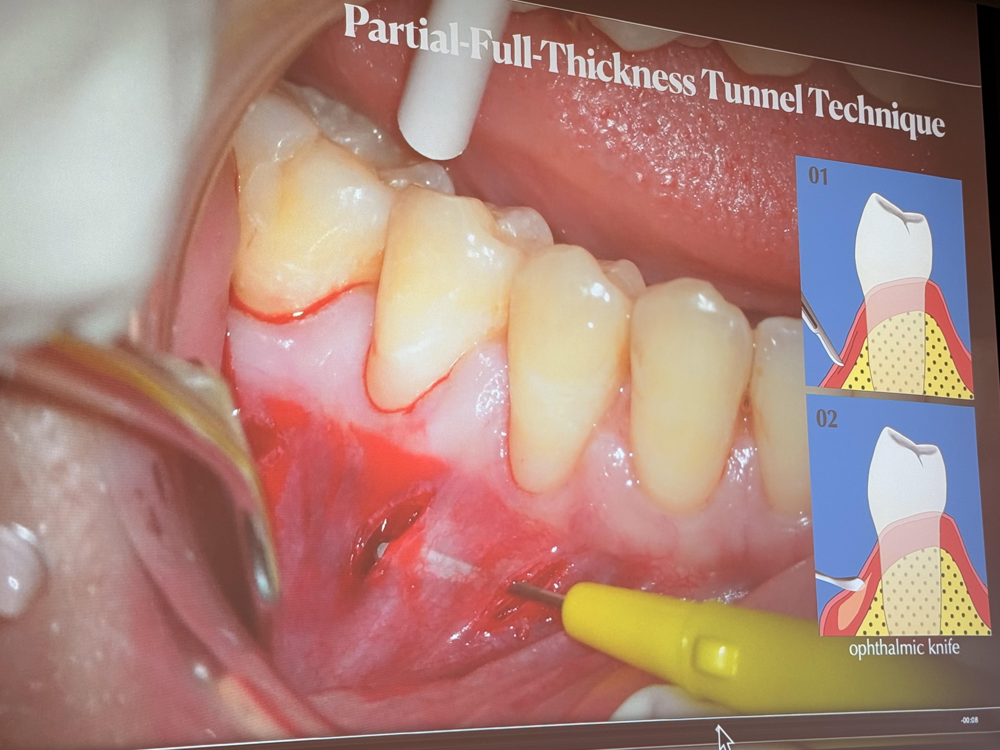

**【AI 精華整理】**

郭博仁醫師於 2025 年 10 月開發的「薄刃 VIBE」課程，源自 2021-2022 年與朱醫師、柏柏、子楊共四人組織的技術研發群組。該課程的核心使命是讓參與者不僅理論理解，更要掌握可帶回診所立即應用的操作 protocol。郭醫師強調「學完就是會的」的教學目標，並建議所有參加者在改進前先遵循既有 protocol 進行前 3-4 例臨床操作，以累積紮實的手術數據。

課程開發並非為了聲稱「我們的方式最好」，而是基於多年累積的大量臨床數據。課堂中郭醫師明確提出希望學員提出任何疑惑，形成互動教學氛圍，並強調 protocol 的實踐性——「帶回去就照著做」。這個理念貫穿整個課程，確保技術能落實到實務中，而不只停留在理論層面。

**【完整潤色原文】**

所以我的壓力在於我要讓大家今天學完之後就是會的。學完就是會的，所以也希望大家如果整個過程當中有任何的疑惑跟想法都不一樣，就隨時跟我們提出，跟我講。我跟工人講都沒有關係，一定要提出來。

然後回去呢，我希望大家就是把我們課堂上的 protocol 整個 protocol 帶回去，帶回去就是照著做，照著做。你要先，你要 modify，你要改變，我都沒意見。但是前三到四個 case，你照著我們的方式做，照著做。我不是說我的，我們的比大家的數字就是最好的，但是我是提超多 data 版的。

我跟朱醫師在提超多 data 版。看了一下，我們這個數字在 2021 年 2022 年開始。然後我們那時候創了一個群組，然後裡面就四個，我、朱朱、柏柏跟子楊。我們那個群組裡面就是每一個禮拜就是在，手術的圖片就是飛來飛去。因為我們一直覺得，我們一直覺得有些事情好像快要，目標就在那邊，快要抵達了，就差一點點而已，就差一點點而已。所以我今天會把這一段過程跟大家分享，跟大家分享。

**【本段重點】**

🔴 **臨床關鍵：** VIBE 課程的核心是傳授「可立即應用的 protocol」，而非空泛理論。

⚡ **Clinical Pearl：** 郭醫師建議學員至少執行 3-4 例手術遵循既定 protocol，積累數據後再進行改進。

⚠️ **常見錯誤：** 跳過 protocol 直接改進手術方法，導致無法客觀評估效果。

💬 **學員問答：** 「要不要在課堂中提問？」→ 「一定要提出來，任何時間都可以」。

📌 **延伸補充：** 該課程開發源於 2021-2022 年郭博仁與朱醫師等四人組織的技術研究小組，經過多年臨床實踐驗證，數據支持度高。

**【概念白話解析】**

1. **Protocol = 導航地圖**：就像開車按照導航路線一樣，先照著做能確保安全到達目的地。改進手術技巧就像改變路線，但前提是你得先成功開過一遍原始路線。
2. **「差一點點」的突破**：2021-2022 年群組成員反覆討論手術照片，感覺技術即將突破，最後開發出 VIBE 這套融合了前人經驗的完整方案。
3. **學完 = 會做**：課程設計目標不是「了解概念」而是「能操作」，所以強調「學完就是會的」。

**【自我測驗】**

Q1（回憶）：VIBE 課程開發的起源小組由幾位醫師組成？他們在何時期間進行開發？
A1：四位醫師（郭博仁、朱醫師、柏柏、子楊），在 2021-2022 年間開發。

Q2（情境）：假設你學完課程後想改進某個手術步驟，郭醫師建議的做法是什麼？
A2：先執行 3-4 例臨床案例遵循原始 protocol，累積數據後再進行改進。

Q3（比較）：課程教學的目標「學完就是會的」與傳統牙科教學「學習概念」有何不同？
A3：VIBE 課程強調實踐能力（能操作），而不只是理論理解。

---

### 段落 2：Soft Tissue Loss 的根本問題 {影片 Part 1 05:00-15:00}

**主題標籤：** #軟組織喪失 #牙齦萎縮 #根部裸露 #keratinized-tissue #bone-crest-loss

**相關概念：** 前置→牙周病理學; 延伸→RT 分類; 跨課程→軟組織厚度評估

**截圖：**
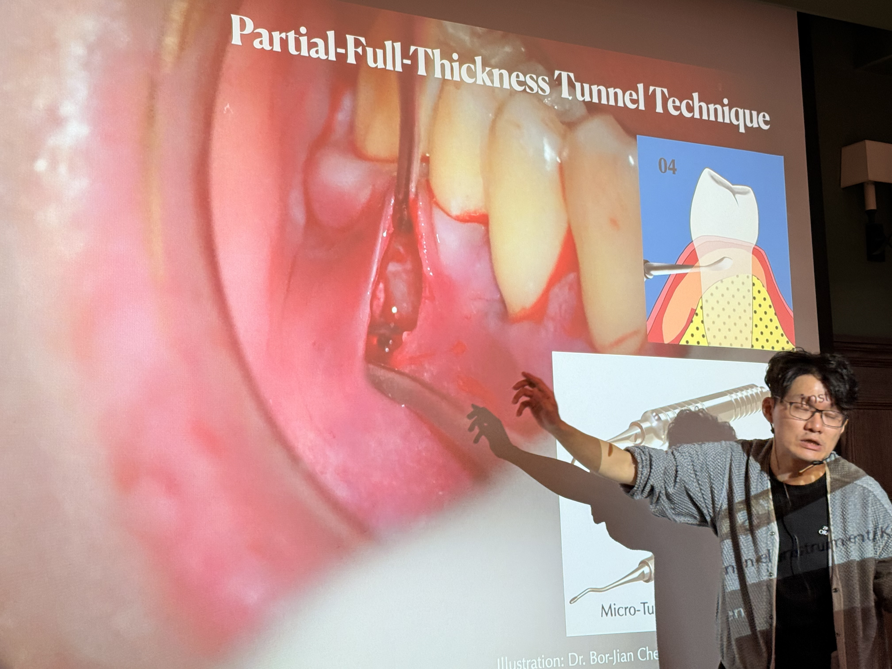

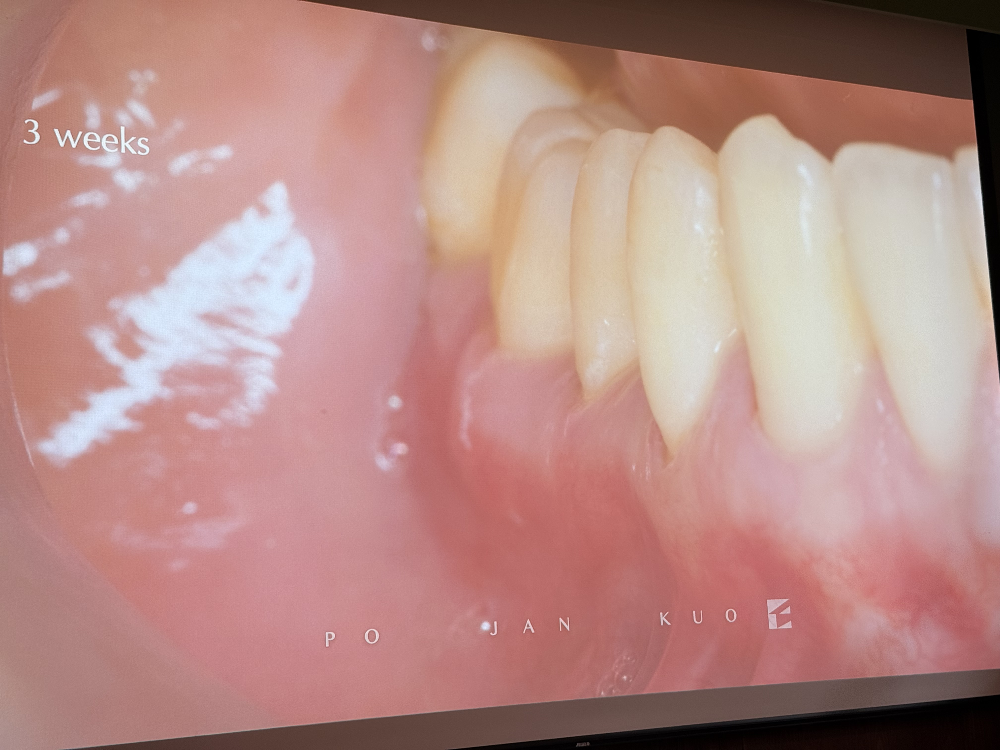

**【AI 精華整理】**

臨床上的「soft tissue loss」呈現為一連串連鎖反應：首先是牙齦萎縮，導致牙根裸露；其次，儘管 MGJ（mucogingival junction）位置基本不變，但 keratinized tissue 的寬度必然減少；同時，該區域軟組織厚度逐漸變薄。最關鍵的發現是：軟組織喪失往往伴隨 bone crest 的進行性喪失。

郭醫師提出的臨床困境是：軟組織管理看似只涉及美觀，但若不在軟組織喪失早期進行預防與保護，bone crest 會持續掉落，最終導致牙齒無法保留，患者面臨植牙困境。因此，soft tissue management 不是可選項目，而是保存天然牙、預防更大損傷的必要性介入。

**【完整潤色原文】**

所以我們要處理的問題就是 soft tissue loss。Soft tissue loss。你在臨床上看到的問題就是第一牙齦萎縮，然後牙根就裸露出來。牙根裸露出來的時候，MGJ 基本上不太會改變，所以隨著牙齦的萎縮出現，你的 keratinized tissue 一定會減少，勢必會減少。另外來講的話，它的厚度會逐漸變薄，厚度會逐漸變薄。

而且通常在變薄的過程當中，我們以往沒有看到的一個部分就是 bone crest 也會隨著萎縮就 loss。所以對我來講，我會說，郭醫師你怎麼確定，你能做出 keratinized tissue 就說 soft tissue management。我說你不做的話就骨頭跟著掉，不要到最後，你這個牙齒都留不住，留不住之後，你還有植牙都很痛苦。所以你要不要在這個階段，就先把它預防保護起來，預防保護起來。這是我的第一個目標。

**【本段重點】**

🔴 **臨床關鍵：** Soft tissue loss 不是美觀問題，而是導致 bone crest loss 的病理序列。如不介入，最終影響牙齒保留。

⚡ **Clinical Pearl：** MGJ 位置相對固定，但隨著萎縮，keratinized tissue 寬度減少、厚度變薄，bone crest 跟著喪失。

⚠️ **常見錯誤：** 將牙齦萎縮視為純美觀問題，忽視其對骨嵴高度和長期牙齒保留的威脅。

💬 **學員問答：** 「為什麼要做 soft tissue management？」→「不做的話骨頭跟著掉，最後牙齒都留不住」。

📌 **延伸補充：** 根據 Paper 2 的流行病學數據，RT2（interproximal CAL ≤ buccal CAL）在一般人口中的患病率為 88.8%；RT3（interproximal CAL > buccal CAL）的患病率為 55.0%。這表示牙齦萎縮是高度普遍的臨床問題，預防性軟組織管理具有重大公共衛生意義。

**【概念白話解析】**

1. **多米諾骨牌效應**：牙齦萎縮 → 根部裸露 → keratinized tissue 減少 → 軟組織厚度變薄 → bone crest loss。每一步都加重下一步，最終導致牙齒喪失。

2. **MGJ 是參考點，不是保護罩**：MGJ（牙齦邊界）位置相對固定，但這不代表軟組織受保護。隨著萎縮，MGJ 上方的組織在不斷減少，整體組織量在貶值。

3. **預防 > 補救**：早期介入軟組織管理，能阻止 bone crest loss；一旦骨嵴喪失嚴重，後續植牙也會很困難。

**【自我測驗】**

Q1（回憶）：Soft tissue loss 在臨床上的四個主要表現是什麼？
A1：牙齦萎縮、牙根裸露、keratinized tissue 寬度減少、軟組織厚度變薄（加上伴隨的 bone crest loss）。

Q2（情境）：一位患者上顎前牙區出現牙齦萎縮，MGJ 位置看似不變，但你發現 keratinized tissue 寬度明顯減少。這表示什麼？
A2：患者的軟組織喪失已經進行（厚度變薄、寬度減少），如果不進行干預，bone crest 可能會接著喪失。

Q3（比較）：為什麼「有軟組織喪失一定要進行 soft tissue management」而不是等到有明顯症狀？
A3：軟組織喪失導致的 bone crest loss 是不可逆的，預防性管理在早期介入才能阻止惡化，一旦骨嵴喪失就很難補救。

---

### 段落 3：Bone Loss vs Soft Tissue Loss 的關係 {影片 Part 1 15:00-25:00}

**主題標籤：** #bone-loss #recession #PDL-attachment #soft-tissue-relationship #lower-anterior

**相關概念：** 前置→軟硬組織基本病理; 延伸→attachment 理論; 跨課程→下顎前牙特殊性

**截圖：**
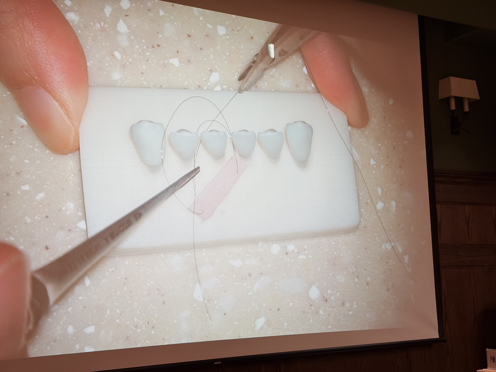

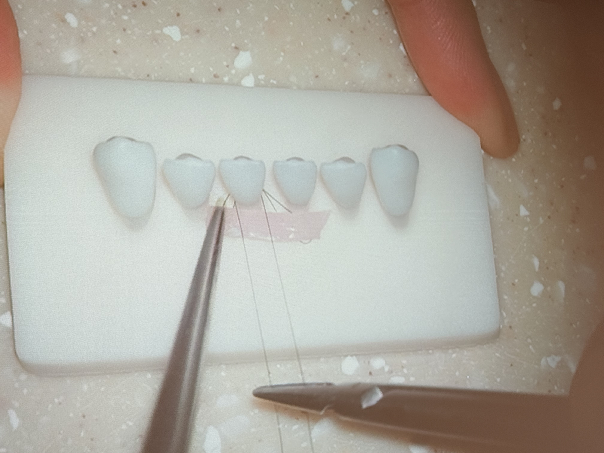

**【AI 精華整理】**

臨床上一個重要但常被誤解的現象是：有 recession 的位置一定存在 bone loss，但反之不成立。即使某區域的 bone crest 明顯降低或厚度減薄，軟組織的高度和形態仍可能保持良好。這種「骨損失，軟組織完好」的解離現象，在下顎前牙區特別普遍——CBCT 測量顯示，距離齦緣 3mm 以下的骨量，約 90% 的下顎前牙患者實際上並無骨頭。

這種解離現象的機制在於 PDL（periodontal ligament）和其所承載的 attachment。強壯的 soft tissue（厚度充足、膠原纖維豐富）以及完整的 PDL attachment 和 connective tissue attachment，足以維持軟組織高度，即使骨骼發生退變。因此，soft tissue 的強健程度，而非 bone 的高度或厚度，才是決定軟組織是否萎縮的關鍵因素。

**【完整潤色原文】**

所以我們發現一件事情。我們發現一件事情。你問我現在有 recession 的位置就會有 bone loss，有 recession 的位置就會有 bone loss。這個邏輯，有 recession 的位置就會有 bone loss。不然會發生什麼事情，你這樣一直說骨頭不會變，因為你的骨頭可以露出來，不可能，這是變 suppuration。對不對。所以有 soft tissue loss 的地方一定有 bone loss。

但是反過來，有 bone 高度的降低，我們就將 bone high loss 好了，有高度的降低，會不會 soft tissue loss，會不會 soft tissue loss，不一定。Why？為什麼？即便我這個位置的骨頭搶到這裡來，我的 soft tissue 看起來還是高的，沒有 recession。Why？有 soft tissue 強壯的話，胯體很好的話，厚度夠，keratinized tissue 的寬度夠，又加上我們的牙齒周邊會有什麼，健康的牙根上面會有什麼東西，會有 PDL 對不對，會有 PDL。有 PDL 就稱為什麼，有 PDL 的位置，我們昨天在講，有 attachment。可以嗎，有 attachment。

有 attachment 的 soft tissue 就不會再 loss。這件事情是因為有疾病才會發生，還是自然狀況之下就會發生？發生什麼事情呢？我的 tissue 高度沒有降，沒有 recession，厚度很好，但是我的 bone 就是很薄或者是高度下降。有沒有這些位置？一定有。在哪裡？Low anterior。Low anterior 你去做 CBCT 的測量，才可以的話，C 這位標準往下三個 millimeter，90% 是沒有 bone 的。OK good，沒有 bone，但 soft tissue 會好。

**【本段重點】**

🔴 **臨床關鍵：** Recession 一定代表 bone loss，但 bone loss 不一定導致 recession。軟組織穩定性由 soft tissue 強健度和 attachment 決定，而非 bone 高度。

⚡ **Clinical Pearl：** 下顎前牙區 90% 患者距齦緣 3mm 以下無骨頭，卻軟組織形態良好——這是 attachment 力量的體現。

⚠️ **常見錯誤：** 過度強調 bone height restoration，忽視 soft tissue stability 是防止 recession 的首要條件。

💬 **學員問答：** 「Bone loss 就一定會有 recession 嗎？」→「不一定，如果 soft tissue 強壯、attachment 完整，即使骨頭少也不會 recession」。

📌 **延伸補充：** 這個概念是理解「bone 不是 first priority」的關鍵。臨床決策應以 soft tissue management 為首要，bone reconstruction 為次要。

**【概念白話解析】**

1. **單向箭頭 vs 雙向箭頭**：Recession → Bone loss（單向，一定會發生）；Bone loss ↛ Recession（不一定，軟組織強壯就能抵抗）。

2. **下顎前牙是最好的教室**：90% 的下顎前牙患者幾乎沒有骨頭，但軟組織形態正常——這直觀證明了 soft tissue 的重要性超越 bone。

3. **Attachment 是無形的支撐**：PDL 和 connective tissue attachment 就像一個看不見的內核，支撐著軟組織的高度。

**【自我測驗】**

Q1（回憶）：「Recession 一定有 bone loss，但 bone loss 不一定有 recession」，這背後的機制是什麼？
A1：完整的 attachment（PDL 和 connective tissue）加上強壯的軟組織，即使骨頭少也能維持軟組織高度。

Q2（情境）：一位患者下顎前牙 CBCT 顯示骨嵴吸收明顯，但臨床檢查軟組織高度和形態正常，無 recession。你應該優先處理什麼？
A2：暫時不需急著重建骨嵴，而應確保軟組織的厚度和強健度，預防未來的 recession 發生。

Q3（比較）：為什麼下顎前牙區儘管多數患者無骨頭，卻仍能保持良好軟組織形態？
A3：下顎前牙的軟組織高度和厚度良好，PDL attachment 完整，這些因素足以抵抗骨頭少帶來的不穩定。

---

### 段落 4：Attachment 理論與 Tissue Stability {影片 Part 1 25:00-35:00}

**主題標籤：** #attachment-theory #PDL #connective-tissue #soft-tissue-priority #focus-line

**相關概念：** 前置→牙周組織基本構造; 延伸→VIBE 設計核心; 跨課程→牙周再生原則

**截圖：**
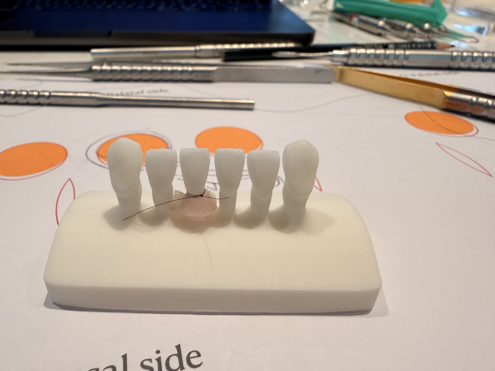

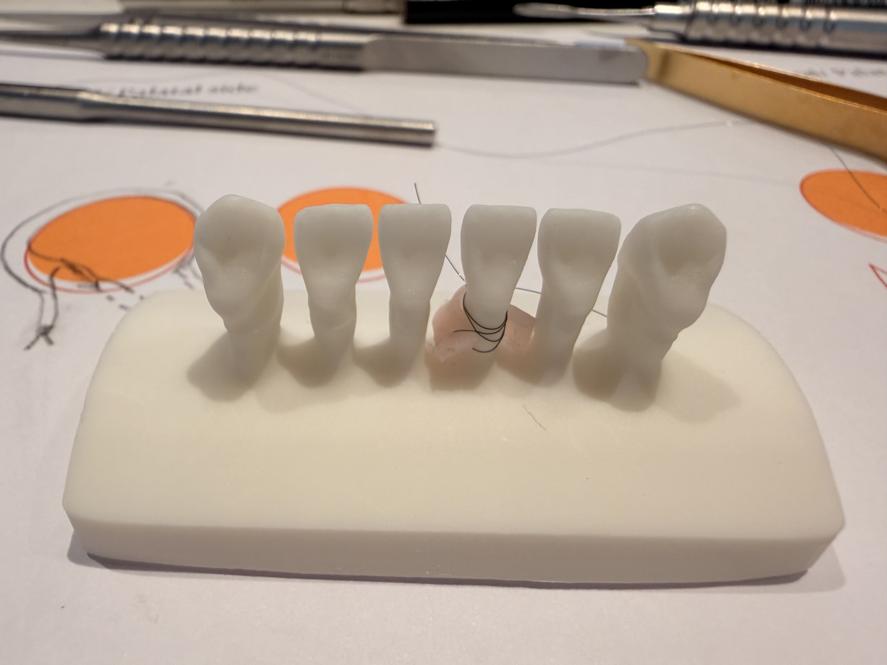

**【AI 精華整理】**

若以軟組織為觀察焦點，評估軟組織的厚度、強健度、膠原纖維質量等條件，會發現軟組織的穩定性與 bone 的高度或厚度並無必然關聯。關鍵在於 soft tissue 的內在品質和其支撐系統——即 PDL attachment 和 connective tissue attachment。當這些 attachment 完整且健康時，即使 bone crest 已經下降或厚度減薄，軟組織仍能維持高度，無需急於進行 bone reconstruction。

這個理念引出課程的核心思想：「bone 不是 first priority」。臨床重建的優先順序應該是：先確保 soft tissue 的厚度和強健度，其次才考慮 bone height restoration。換言之，在 VIBE 手術設計中，CTG（connective tissue graft）用於支撐和增強 buccal tissue，確保整體軟組織的生物穩定性，而非執著於 bone 的恢復。這正是課程名稱「Bone and tissue Enhancement」中「tissue first」的理念。

**【完整潤色原文】**

所以如果我看的是 soft tissue，soft tissue 厚度跟它的強健的程度，我需不需要一定要的 bone？我想要趕快在這時候把這個概念趕快植入。不一定需要，對不對？不一定需要。你這些牙齒天然的沒有做過矯正，患者其實牙齒會咬嗎？不會咬。牙齦看起來很好，可是你去做 CBCT 就是沒有 bone。

所以對我來說，如果我要重建的這一塊，我已經 soft tissue lost，我已經在這個階段，我要把它恢復過去，bone 是不是一個 first priority？是不是我一定要急著解決的第一件事情？不是。因為我這個 bone，我沒有把高度增加，我沒有把厚度增加，我的軟組織如果因為疾病而退化，我依然可以通過軟組織的重建，通過 strong attachment 來維持软組織的高度。

所以說，bone 不是 first priority。很多人都說，那我也許會問你，那我的 bone 怎麼辦？你看我下面這個 bone 都掉了。好的，bone 你如果需要的話，我們 GTR 來做。GTR 做了之後如果長不回來，你還是有 soft tissue 的支撐。這個概念真的非常重要。

**【本段重點】**

🔴 **臨床關鍵：** Soft tissue 的穩定性由 attachment 質量決定，bone crest 的高度只是附帶因素。臨床重建應優先確保 soft tissue，其次才考慮 bone。

⚡ **Clinical Pearl：** 即使 bone crest 已大幅下降，strong attachment 仍能維持軟組織高度，預示著 soft tissue management 的優先性。

⚠️ **常見錯誤：** 過度關注 bone height restoration，導致 soft tissue management 被邊緣化。

💬 **學員問答：** 「Bone 掉了怎麼辦？」→「Bone 如果需要再生，用 GTR；但如果 GTR 不成功，你還有強壯的 soft tissue 支撐」。

📌 **延伸補充：** 這個優先順序的轉變源自循證醫學和長期臨床數據。VIBE 技術的創新在於明確把 soft tissue 放在首位，而非盲目追求 bone regeneration。

**【概念白話解析】**

1. **護城河理論**：強壯的軟組織就像城堡的護城河，即使城牆（骨嵴）有裂痕，護城河完整仍能保護城堡。Bone 缺陷可以後續修補，但 soft tissue 的保護必須優先。

2. **Attachment = 無形支撐**：就像建築的地基，即使看不見，卻決定了整個結構的穩定性。PDL 和 connective tissue attachment 就是軟組織的「地基」。

3. **優先順序的實踐**：First → Soft tissue quality；Second → Bone if needed；Result → Tissue stability > Bone height。

**【自我測驗】**

Q1（回憶）：「Bone 不是 first priority」的核心論據是什麼？
A1：軟組織的穩定性由 attachment 質量決定，即使骨嵴喪失，完整的 attachment 仍能維持軟組織高度。

Q2（情境）：一位患者下顎前牙已有明顯 bone loss，但軟組織厚度和形態良好。你的治療計劃應優先考慮什麼？
A2：優先確保軟組織的厚度和強健度，預防未來 recession；骨頭重建（GTR）可作為次要選項。

Q3（比較）：VIBE 課程強調「tissue first」與傳統牙周重建「bone first」有何根本差異？
A3：VIBE 認為軟組織穩定性是基礎，bone 恢復是補助；傳統方法往往過度追求 bone height，忽視 soft tissue 的重要性。

---

### 段落 5：RT 分類與 Complete Recovery Rate {影片 Part 1 35:00-50:00}

**主題標籤：** #RT分類 #complete-recovery-rate #Miller-classification #interdental-attachment #CRC

**相關概念：** 前置→牙齦萎縮分類學; 延伸→手術可預測性; 跨課程→案例分層分析

**截圖：**
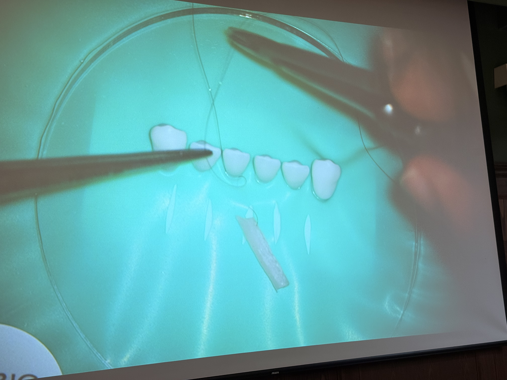

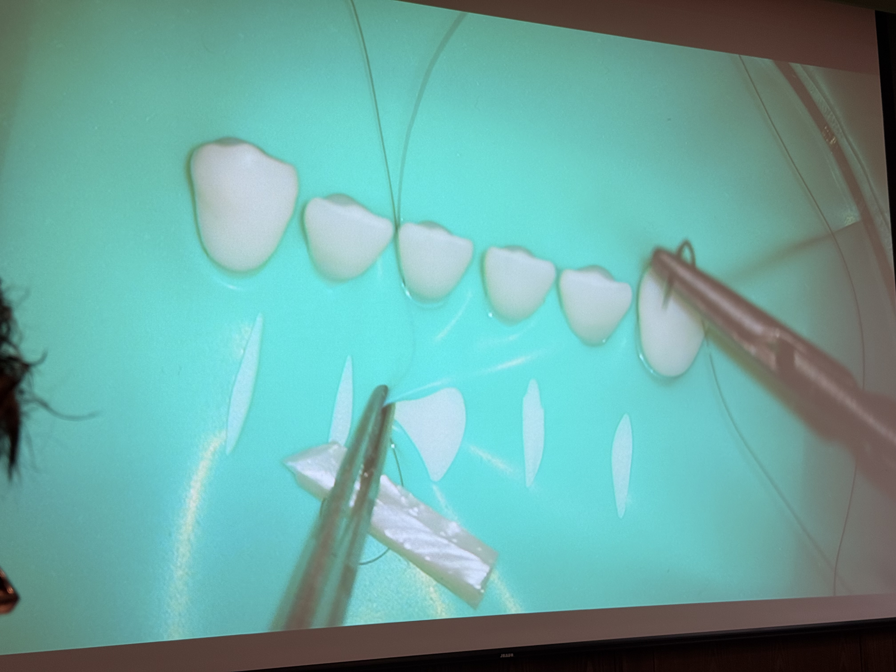

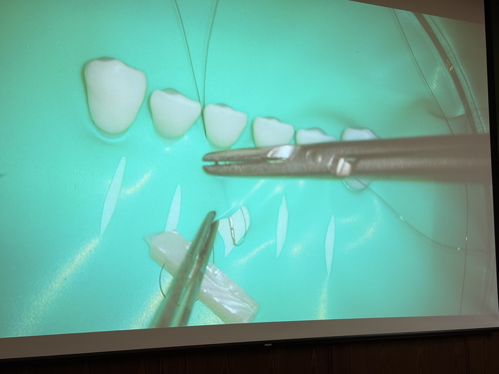

**【AI 精華整理】**

Recession 的根本分類依據是「interproximal attachment」的喪失程度，而非傳統 Miller Class 單純以根面覆蓋為標準。Recession Type（RT）體系分為三類：

- **RT1**：Interproximal CAL = Buccal CAL，只有 buccal 軟組織喪失，interproximal tissue 完整。Complete recovery rate 通常高達 87-100%。

- **RT2**：Interproximal CAL ≤ Buccal CAL，既有 buccal loss 又有 interproximal loss，但程度相當或 buccal 更嚴重。Complete recovery rate 傳統方法為 0-24%；VIBE 技術將 CRC 提升至 87.5-100%。

- **RT3**：Interproximal CAL > Buccal CAL，interproximal loss 嚴重超過 buccal，代表 interdental papilla 明顯喪失。傳統 CRC = 0%；VIBE 技術達 63.64%。

interdental attachment 的完整性是決定手術預測性的關鍵。即使 buccal recession 嚴重（RT2/RT3），只要 interdental tissue 尚存（即使喪失量超過 buccal），該區域保留了營養供應和機械支撐。VIBE 的創新在於通過 PFT tunnel 和 SCS suture，即使在 interproximal CAL 存在的情況下，仍能達成完全根面覆蓋。

臨床流行病學資料（Paper 2）顯示：RT2 患病率 88.8%，RT3 患病率 55.0%。過去 RT2/RT3 的不可預測性（CRC 0-24%）意味著大多數實際臨床病患面臨困難，VIBE 技術的突破因此具有重大臨床意義。

**【完整潤色原文】**

所以我們就依照 interproximal attachment 的狀況將 recession 分成了三類。RT1、RT2 跟 RT3。RT1 的定義就是，interproximal CAL 等於 buccal CAL。也就是說，只有 buccal 那邊有 loss，但是 interproximal 這邊沒有 loss。所以如果是 RT1 的話，你去做任何一個手術都可以，recovery rate 都很高，可以高達 87 到 100%。

RT2 的定義就是，interproximal CAL 小於等於 buccal CAL。也就是說，buccal 這邊有 loss，interproximal 也有 loss，但是相比之下，buccal 的 loss 比較嚴重，或者說兩邊差不多嚴重。在以前，RT2 的 CRC 是多少？0 到 24%。用現在的 VIBE 技術呢，我們可以達到 87.5 到 100%。

RT3 呢，interproximal CAL 大於 buccal CAL。也就是說 interproximal 的 loss 比 buccal 還要嚴重。意思就是說，papilla 明顯喪失掉了。在以前，RT3 的 CRC 是 0%。用 VIBE，我們現在可以達到 63.64%。所以這個改進是非常巨大的。

而且，interdental tissue 完整性是非常非常重要的。即便我 buccal recession 非常嚴重，但我的 interdental tissue 還在，這個位置就有機會。為什麼？因為 interdental tissue 還在，就代表這個位置還有營養供應，還有機械支撐，還可以做得起來。

**【本段重點】**

🔴 **臨床關鍵：** Interdental attachment 的完整性是判斷手術預測性的最重要因子，而非單純的 buccal recession 程度。

⚡ **Clinical Pearl：** RT1 無論用何種術式都易成功；RT2/RT3 在 VIBE 前幾乎不可預測，現在 CRC 可達 63-100%。

⚠️ **常見錯誤：** 用傳統 Miller Class 分類評估 RT2/RT3 的預測性，導致治療計劃過度保守。

💬 **學員問答：** 「為什麼 RT2/RT3 即使 papilla 明顯喪失還有機會？」→「因為 interdental tissue 還有營養供應和機械支撐」。

📌 **延伸補充：** Paper 1（Kuo et al., 2024）在 2 例患者 8 例 RT2/RT3 defects 上達成 87.5% CRC；Paper 2（Kuo et al., 2025）在 7 例患者 22 個下顎後牙 RT2/RT3 defects 上達成 63.64% CRC。對比歷史數據（RT2/RT3 CRC = 0-24%），進步是革命性的。

**【概念白話解析】**

1. **Interdental tissue = 生命線**：即使 buccal 根部露得再厲害，只要 interdental papilla 還有組織，這個位置就有營養和支撐，手術才有成功機會。

2. **RT 分類是臨床預測器**：RT1 就像輕症，什麼都行；RT2/RT3 就像重症，但 VIBE 把重症的成功率從 0-24% 提升到 60-100%。

3. **數據轉折的意義**：從 0% 到 63%，從 0-24% 到 87.5%，這不只是技術改進，而是改變了整個治療難度等級的評估。

**【自我測驗】**

Q1（回憶）：RT1、RT2、RT3 的核心區別是什麼？
A1：RT1 只有 buccal loss，interproximal 完整；RT2 兩邊都有 loss 但 buccal 較嚴重；RT3 interproximal loss 嚴重超過 buccal。

Q2（情境）：患者上顎側門牙有明顯 recession 且 interdental papilla 完全喪失。這是哪種 RT 分類？用傳統術式的成功率如何？用 VIBE 呢？
A2：RT3（interproximal CAL > buccal CAL）。傳統術式 CRC = 0%；VIBE 技術 CRC = 63.64%。

Q3（比較）：為什麼 interdental attachment 的完整性比 buccal tissue 厚度更重要？
A3：Interdental attachment 決定了該區域的營養供應和機械支撐，即使 buccal 根部露得很多，有 interdental tissue 支撐就有成功機會。

---

### 段落 6：CTG 的角色 — 為什麼需要 Coverage {影片 Part 1 50:00-65:00}

**主題標籤：** #CTG #connective-tissue-graft #coverage #blood-supply #esthetic-outcome

**相關概念：** 前置→軟組織移植基本原理; 延伸→CTG 設計尺寸; 跨課程→血管化與癒合

**截圖：**
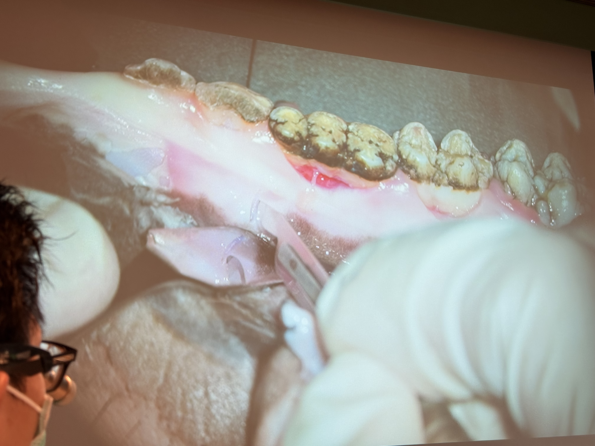

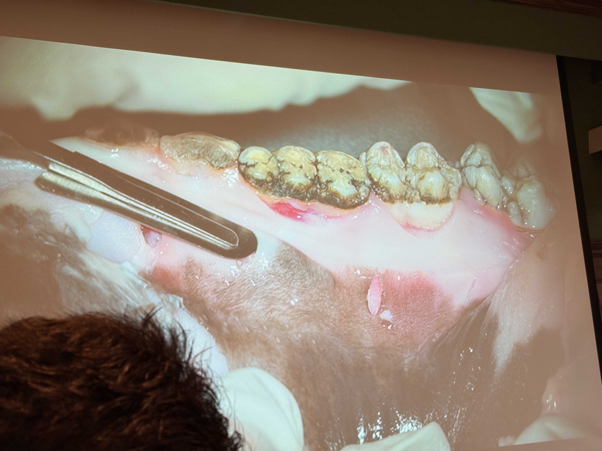

**【AI 精華整理】**

Connective tissue graft（CTG）在根面覆蓋手術中的角色不僅是填充，更是提供生物支撐。CTG 本身不能暴露在口腔環境——一旦 CTG 直接暴露（未被 buccal tissue 覆蓋），會面臨兩大問題：

1. **美觀問題**：裸露的 CTG 呈白色或黃色，不符合牙齦色澤，嚴重影響前牙美觀。

2. **血供問題**：CTG 的營養來自深層組織，若表面暴露失去上層軟組織的被動保護，血供降低，影響癒合和長期穩定性。

因此，覆蓋 CTG 的 buccal tissue 必須足夠強壯且厚度充足。郭醫師提出的臨床法則是：**裸露 CTG 的面積與被覆蓋 CTG 面積的比例應控制在 1:10 以內**。這意味著，若 CTG 總面積為 100 mm²，最多只能暴露 10 mm²，其餘 90 mm² 必須被上層軟組織完全覆蓋。

這個比例並非任意，而是基於血供足夠性、上皮化速度和美觀結果的平衡。面積超出 1:10 的 CTG 暴露，不僅美觀效果受損，也會因血供不足而影響癒合。

**【完整潤色原文】**

所以我們為什麼一定要 coverage？因為 CTG 不能 exposure。為什麼 CTG 不能 exposure？第一個原因就是美觀，CTG 露出來是什麼顏色？白色或者是黃色。牙齦應該是粉紅色，所以一旦 CTG 露出來，美觀受損。第二個原因是什麼？血供。CTG 的血供是來自於深層的組織，那麼如果上面沒有 buccal tissue 的覆蓋，血供會降低，會影響癒合。

那麼我們怎麼確保 CTG 被覆蓋呢？我想到的方法是，我的 buccal tissue 必須強壯，厚度必須夠。怎麼樣才叫夠？我提出一個概念，就是說，如果裡面的 CTG 面積，暴露的面積跟被覆蓋的面積的比例，這個比例應該是 1:10。為什麼是 1:10？經驗談。這樣子的話，上面被覆蓋的 buccal tissue 才能夠足夠強壯，才能夠維持 CTG 的血供。

**【本段重點】**

🔴 **臨床關鍵：** CTG 必須被完全覆蓋以維護美觀和血供，這是根面覆蓋手術成功的前提。

⚡ **Clinical Pearl：** 1:10 覆蓋比例的提出源於平衡血供足夠性和上皮化速度的臨床經驗。

⚠️ **常見錯誤：** 為了增加 coverage 面積，取過大的 CTG 而導致供區併發症；或 CTG 太小導致暴露過多。

💬 **學員問答：** 「CTG 暴露有什麼壞處？」→「美觀受損（白黃色而非粉紅色）+ 血供降低影響癒合」。

📌 **延伸補充：** Paper 5（Do, 2019）首次提出 SPS suture 概念，強調通過獨立於上層軟組織的縫線系統穩定 CTG，這正是確保 CTG 被良好覆蓋並維持血供的技術基礎。

**【概念白話解析】**

1. **1:10 比例 = 安全邊界**：就像建築的安全係數，留出 90% 的覆蓋面積能確保 CTG 獲得穩定的血供和美觀結果。

2. **CTG 顏色 = 品質指標**：白色 CTG 露出 = 美觀和血供雙重失敗。粉紅色被覆蓋的 CTG = 血供充足、癒合良好。

3. **血供 > 面積**：與其做一個龐大但部分暴露的 CTG，不如做一個小而完全被覆蓋的 CTG，結果更好。

**【自我測驗】**

Q1（回憶）：CTG 暴露會導致哪兩類問題？
A1：美觀問題（白黃色不符牙齦色澤）+ 血供問題（深層營養供應不足，影響癒合）。

Q2（情境）：你計劃做一個根面覆蓋手術，CTG 總面積為 80 mm²。根據 1:10 原則，最多能暴露多少面積？
A2：8 mm²。其餘 72 mm² 必須被 buccal tissue 完全覆蓋。

Q3（比較）：為什麼不能讓 CTG 完全暴露（在 scaffold 上），而是必須被上層軟組織覆蓋？
A3：完全暴露會導致美觀失敗（顏色不符）、血供不足（癒合延遲）、長期穩定性下降。

---

### 段落 7：CTG 大小設計 — 多大才夠？ {影片 Part 1 65:00-80:00}

**主題標籤：** #CTG設計 #厚度要求 #layer-by-layer #supra-crestal-sling #供區選擇

**相關概念：** 前置→CTG 尺寸計算; 延伸→顎部解剖學; 跨課程→供源與受源配對

**截圖：**
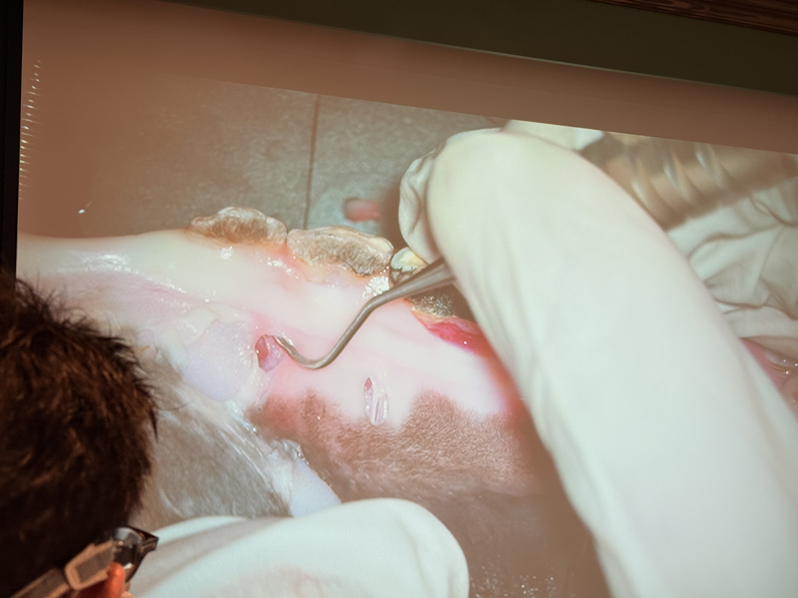

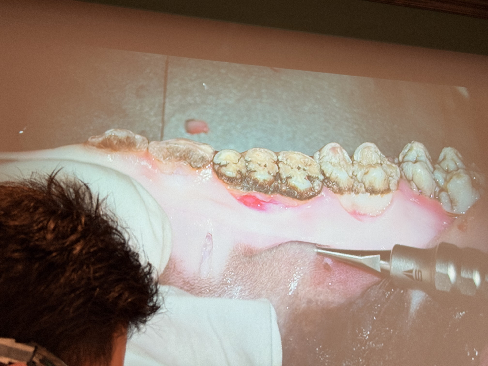

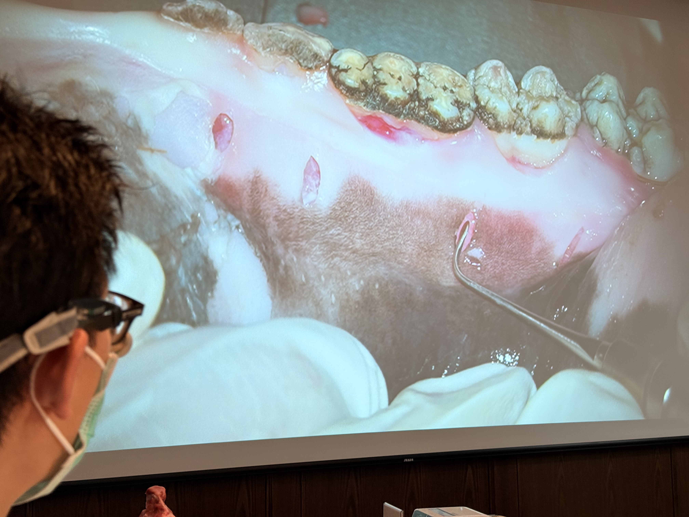

**【AI 精華整理】**

CTG 的大小設計並非「越大越好」，而是基於生物學需求精確計算。郭醫師強調的核心原則是：**CTG 的厚度加上上層 buccal tissue 的厚度，總和需要達到 1.5mm 以上**。

這個標準的生物學意義在於：
- **Mucosa 薄不怕 recession**：黏膜層天然較薄，但只要上方有 keratinized tissue 或強壯的結締組織層，就能維持軟組織的穩定性，無需過度補償。
- **結構 > 面積**：不需要「德州牛排」大小的 CTG，而是精確計算所需厚度。
- **復層概念**：整體軟組織厚度（CTG + buccal tissue）才是評估標準，而非單純 CTG 面積。

實際操作上，CTG 的位置固定通常採用 **supra-crestal sling suture** 技術。這套縫線系統穿過 CTG，在骨膜層固定，而非依賴上層軟組織的被動覆蓋。這樣做的優勢是：

1. **獨立穩定**：CTG 固定位置不受上層軟組織鬆弛的影響。
2. **冠向推進**：suture 位置設定能讓 CTG 維持在最佳的冠向位置。
3. **血供優化**：骨膜側面（suture 穿過的部分）血供豐富，有利於 CTG 的存活和整合。

這正是 VIBE 命名中「Bone and tissue Enhancement」的具體體現——既增強軟組織厚度，也通過精確的骨膜層固定方式優化整體效果。

**【完整潤色原文】**

所以我要強調一個概念。我要強調一個概念。CTG 的厚度加上 buccal tissue 的厚度，加起來需要超過 1.5 millimeter。這樣子的話，你的軟組織才能夠穩定，才能夠長期的保持。為什麼呢？因為 mucosa 薄不怕 recession。Mucosa 本身就比較薄。所以重點不是 mucosa 厚不厚，重點是上面強不強。上面如果夠厚、夠強，那 mucosa 薄就不怕。

CTG 不用拿那麼大塊。有些人就是拿德州牛排一樣的大塊 CTG。我就會想，你何必呢？你計算一下，其實你只需要厚度。怎麼確保厚度？就是 CTG 加上 buccal tissue，加起來要超過 1.5。所以 CTG 不用拿那麼大。

那 CTG 的固定，我們是怎麼樣固定的呢？我們用的是 supra-crestal sling suture。什麼意思？這個 suture 是固定在骨膜這一層。它不是依賴上面的 buccal tissue 的被動覆蓋。它是說，我這個 suture 穿過 CTG，然後它固定在骨膜層。骨膜層的血供最豐富，所以這樣子的話，CTG 的血供會最好。而且 CTG 的位置會最穩定。

所以說，supra-crestal sling suture 的概念就是，讓 CTG 能夠維持在最佳的冠向位置，而且血供最豐富。這樣子的話，我們的根面覆蓋效果才能夠最好，軟組織的厚度才能夠最好，軟組織的穩定性才能夠最好。

**【本段重點】**

🔴 **臨床關鍵：** CTG 大小以厚度為標準（1.5mm total），而非面積。Supra-crestal sling suture 確保獨立穩定和血供優化。

⚡ **Clinical Pearl：** CTG + buccal tissue ≥ 1.5mm 是長期軟組織穩定的生物學標準，無需過度龐大的移植物。

⚠️ **常見錯誤：** 取過大 CTG（供區併發症增加、浪費）或忽視厚度標準（導致長期不穩定）。

💬 **學員問答：** 「CTG 要多大？」→「不看面積，看厚度。CTG + buccal tissue 要超過 1.5mm」。

📌 **延伸補充：** Paper 5（Do, 2019）在 SPS suture 原創論文中首次系統描述了骨膜層固定的技術優勢，強調骨膜側面的豐富血供。VIBE 的 supra-crestal sling suture 正是在此基礎上的臨床應用優化。

**【概念白話解析】**

1. **層次概念 > 面積概念**：不問「CTG 多大」，而問「總厚度多少」。就像建築，重要的是結構層數而非地面面積。

2. **1.5mm = 臨界厚度**：這是生物學上軟組織能維持穩定的最小厚度。低於此值會有長期不穩定風險。

3. **骨膜側 = VIP 位置**：骨膜層血供最豐富，suture 固定在此處確保 CTG 存活和長期整合。

**【自我測驗】**

Q1（回憶）：CTG 大小設計的標準是什麼？為什麼不是面積？
A1：標準是厚度（CTG + buccal tissue ≥ 1.5mm）。因為 mucosa 薄不怕 recession，關鍵是上方結構的強度和厚度。

Q2（情境）：你計劃做一個根面覆蓋手術，buccal tissue 的現存厚度為 0.8mm。根據 1.5mm 標準，你需要取多厚的 CTG？
A2：至少 0.7mm（0.8 + 0.7 = 1.5mm）。實際可取 0.8-1mm 以留安全邊際。

Q3（比較）：為什麼 supra-crestal sling suture 的骨膜層固定比傳統上層固定更優越？
A3：骨膜層血供豐富，能確保 CTG 的存活和整合；獨立於上層軟組織，CTG 位置更穩定，不受 buccal tissue 鬆弛影響。

---

## 總結與過渡

段落 1-7 涵蓋了模組一（理論基礎）與模組二前半（CTG 原則）的核心內容，建立了以下知識框架：

1. **教學宗旨**（段落 1）：VIBE 是可實踐的、基於數據的 protocol
2. **病理基礎**（段落 2）：軟組織喪失導致多米諾效應，預防性管理至關重要
3. **軟硬組織關係**（段落 3）：Soft tissue stability 由 attachment 決定，非 bone height
4. **臨床優先順序**（段落 4）：Bone 不是 first priority，soft tissue management 優先
5. **分層預測模型**（段落 5）：RT 分類精準預測術式成功率，VIBE 改變了 RT2/RT3 的可預測性
6. **CTG 角色**（段落 6）：CTG 必須被覆蓋（1:10 比例），維護美觀和血供
7. **CTG 設計標準**（段落 7）：厚度優先（≥1.5mm），supra-crestal sling suture 優化血供和穩定性

下一階段（段落 8-14）將進入模組二後半與模組三，涵蓋 VIBE 手術技巧、器械選擇、切口設計、CTG 放置、縫合步驟等核心操作內容。

---

### 段落 8：Focus Line 與 Soft Tissue 厚度標準 {影片 Part 1 80:00-95:00}

**主題標籤：** #tissue-quality #厚度要求 #寬度標準 #minimal-requirement #10年數據

**相關概念：** 前置→CTG設計(段落7); 延伸→根面覆蓋目標; 跨課程→軟硬組織關係(段落3)

**截圖：**
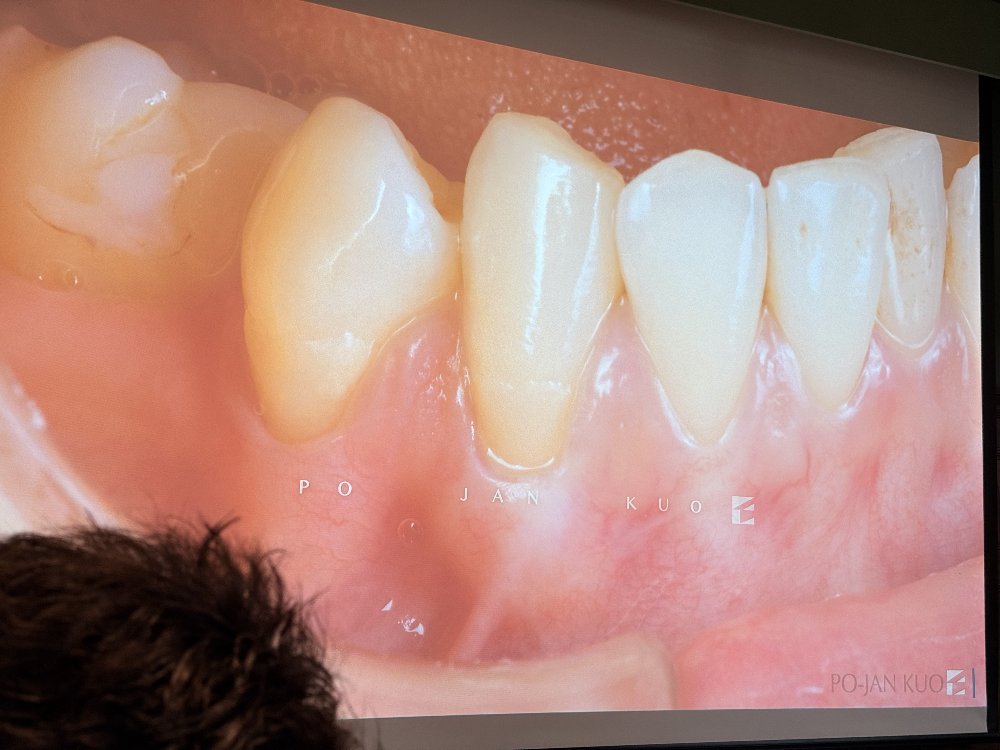

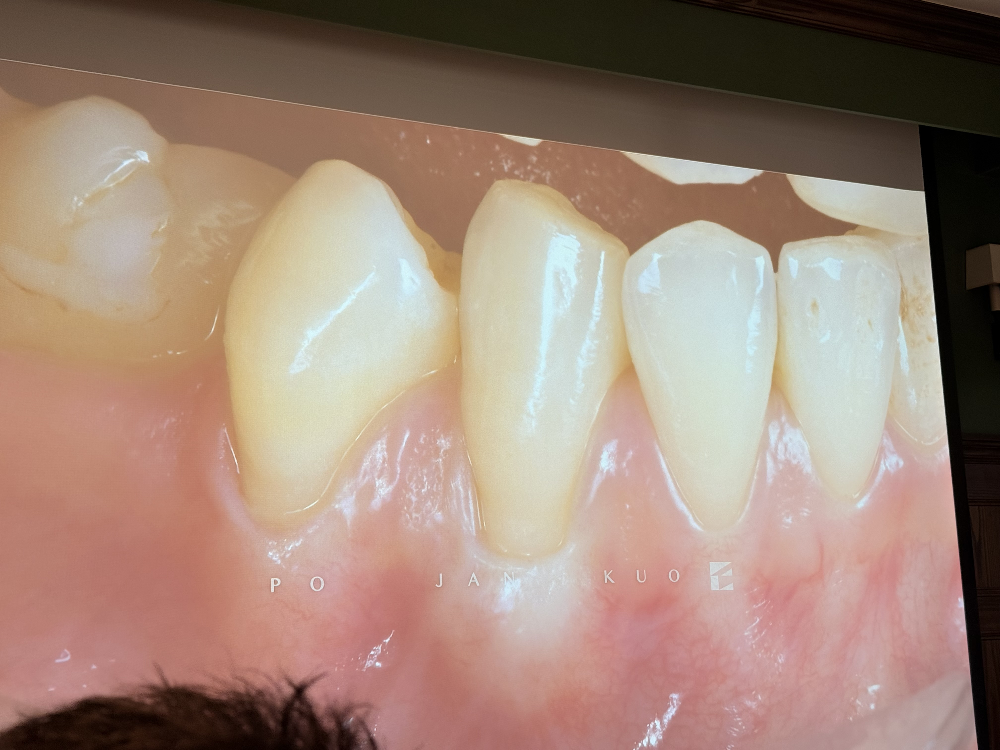

**【AI 精華整理】**

根面覆蓋手術的最終目標不是無限增厚軟組織，而是達到**生物學上的臨界厚度與寬度標準**。郭醫師強調的 Focus Line（焦點線）概念是在 mid-buccal recession area 重建標準化的軟組織結構。

軟組織品質（Tissue Quality）的定義基於兩個量化指標：
1. **厚度 > 1.0mm**：黏膜與結締組織的總厚度。
2. **寬度 > 1.0mm**：附著在牙齒表面、不活動的角化牙齦寬度。

這兩個數值看似微小，但其背後的生物學意義深遠。黏膜組織（mucosa）天然較薄，不會因為薄而自動發生 recession。關鍵在於上方是否有足夠厚實的結構（attached gingiva 或強壯的 CTG）來支撐。因此，**「厚度優先、寬度並重」是軟組織穩定性的真正決定因素**。

**長期臨床數據支持**：Paper 2 統計的 10 年追蹤數據顯示，當軟組織厚度達到 1.5mm 時，10 年內的 recession 量幾乎控制在 0.5mm 以內；當厚度達到 1.6-1.75mm 時，幾乎沒有額外的 recession 發生。這意味著**補到 1.5mm 就達到了生物學穩定的臨界點**，無需盲目追求 2.0mm 以上。

**【完整潤色原文】**

所以我要強調一個概念。CTG 的厚度加上 buccal tissue 的厚度，加起來需要超過 1.5 millimeter。這樣子的話，你的軟組織才能夠穩定，才能夠長期的保持。為什麼呢？因為 mucosa 薄不怕 recession。Mucosa 本身就比較薄。所以重點不是 mucosa 厚不厚，重點是上面強不強。上面如果夠厚、夠強，那 mucosa 薄就不怕。

那什麼叫做 tissue quality 很好呢？定義是什麼？厚度大於一個 mm 的，寬度假設很大一個 mm 的。所以我們要的並沒有那麼多。特別是在自然牙，牙齦厚度最後只要一個 mm 以上，就是很棒的。牙齦的寬度或者說它附著在牙齒表面，這一個不會動的角化外形，一個 mm 以上就已經很好了。

我會把這一個數值作為未來我做完 root coverage 的目標。做完 root coverage 的目標就是我的厚度超過 1，我的角質的話寬度超過 1。這是我的 minimum requirement。這個位置太薄，我就是要把它增厚。這個位置角質的話牙齦寬度也不夠，我增厚之餘還要再增寬。

接下來，厚度達於 1 就是好，那有什麼數值告訴我們，我要大於 1 到多少？譬如說我補到 2、3、4 也是大於 1，那為什麼不補 2、3、4？數值上面 long term follow up 10 年去看，做完 root coverage 這些患者，它經過 10 年萎縮的量，跟剩餘的牙齦厚度的關係，你會發現到只要 1.5，它的 recession 量幾乎在 0.5mm 以內。甚至你如果可以做到 1.6、1.75，幾乎就沒有 recession。

**【本段重點】**

🔴 **臨床關鍵：** Tissue Quality 的量化標準：厚度 ≥ 1.0mm + 寬度 ≥ 1.0mm = minimum requirement。10 年穩定的臨界厚度是 1.5mm。

⚡ **Clinical Pearl：** Mucosa 薄不怕 recession，關鍵是上方結構的強度。不需盲目追求極厚 CTG，而是精確達到 1.5mm 即可達到生物學穩定。

⚠️ **常見錯誤：** 誤以為 mucosa 厚度決定 recession 風險，導致過度移植；或補到 2.0mm 以上導致供區併發症增加。

💬 **學員問答：** 「補到多厚才算夠？」→「不是越厚越好，1.5mm 就是臨界點。Paper 2 的 10 年數據證實了這一點」。

📌 **延伸補充：** Paper 2（Kuo et al., 2025）針對 RT2/RT3 的 22 個病灶進行 12 個月追蹤，所有達到 1.5mm 厚度的位置都表現出穩定的軟組織。此外，Paper 1 的患者組也驗證了相同的厚度標準。這與傳統「越厚越好」的觀念形成對比，反映出 VIBE 的精確、循證做法。

**【臨床決策樹】**

```
軟組織厚度評估
├─ 厚度 < 1.0mm
│  └─ → 增厚至 1.5mm
├─ 厚度 1.0-1.5mm
│  ├─ 寬度 < 1.0mm → 增厚 + 增寬至 1.5 + 1.0mm
│  └─ 寬度 ≥ 1.0mm → 只需增厚至 1.5mm
└─ 厚度 ≥ 1.5mm
   └─ → 長期穩定，無需過度補償
```

**【概念白話解析】**

1. **1.0mm 基線，1.5mm 保險線**：就像建築結構，1.0mm 是最低標準，1.5mm 是保證 10 年不出問題的安全係數。

2. **厚度 vs. 寬度的雙維度**：不能只看厚度，也要看寬度。厚但寬度不夠，仍無法抵抗 recession；寬但太薄，也會長期萎縮。

3. **Mucosa 是隱形的角色**：黏膜天然薄，但只要上層結構強，它就不會 recession。這改變了許多牙醫對軟組織的認知。

**【自我測驗】**

Q1（回憶）：Tissue Quality 的兩個量化指標是什麼？
A1：厚度 > 1.0mm 且寬度 > 1.0mm。

Q2（情境）：你評估患者根面覆蓋部位，現存軟組織厚度 0.8mm、寬度 1.2mm。根據臨床標準，你需要做什麼？
A2：只需增厚至 1.5mm（寬度已達標）。不需因寬度達標而放鬆對厚度的要求。

Q3（比較）：為什麼 Paper 2 的 10 年追蹤數據表明 1.5mm 是臨界值，而不是 2.0mm？
A3：因為生物學上，1.5mm 厚度足以抵抗 10 年內 0.5mm 以內的 recession（自然衰退），已達長期穩定。進一步增厚邊際效益遞減，反而增加供區風險。

---

### 段落 9：手術方法比較 — CAF、Vista、Tunnel 對比 VIBE {影片 Part 1 95:00-115:00}

**主題標籤：** #手術比較 #CAF分層 #肌肉解除 #RT2RT3挑戰 #VIBE創新動機

**相關概念：** 前置→軟組織層次(段落3); 延伸→flap-design; 跨課程→手術技巧選擇

**截圖：**
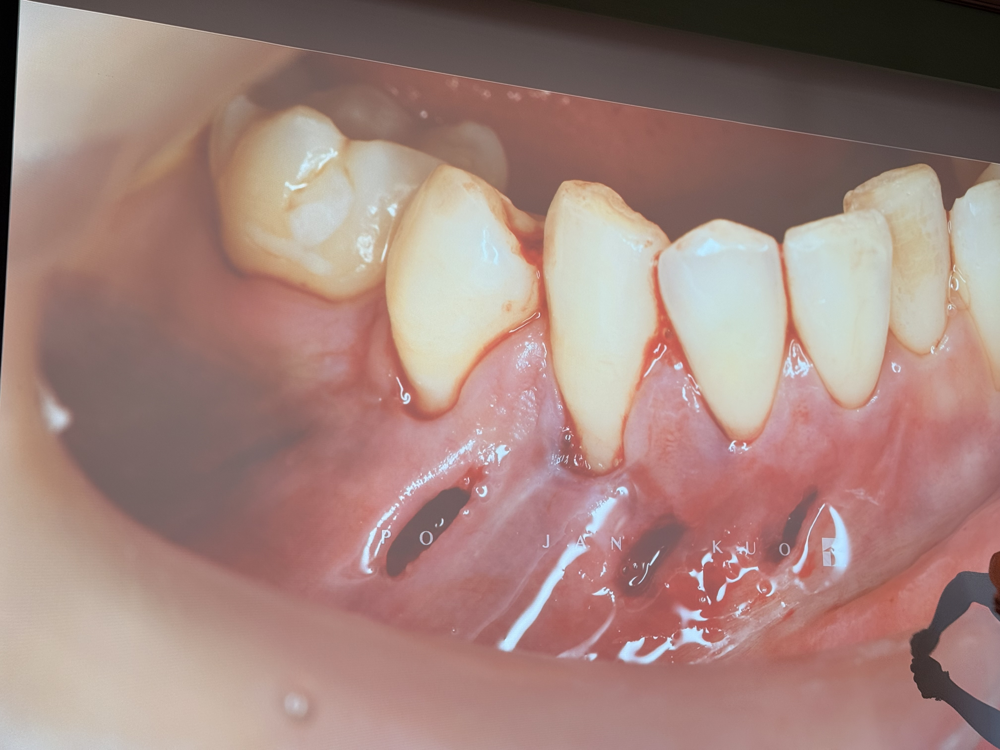

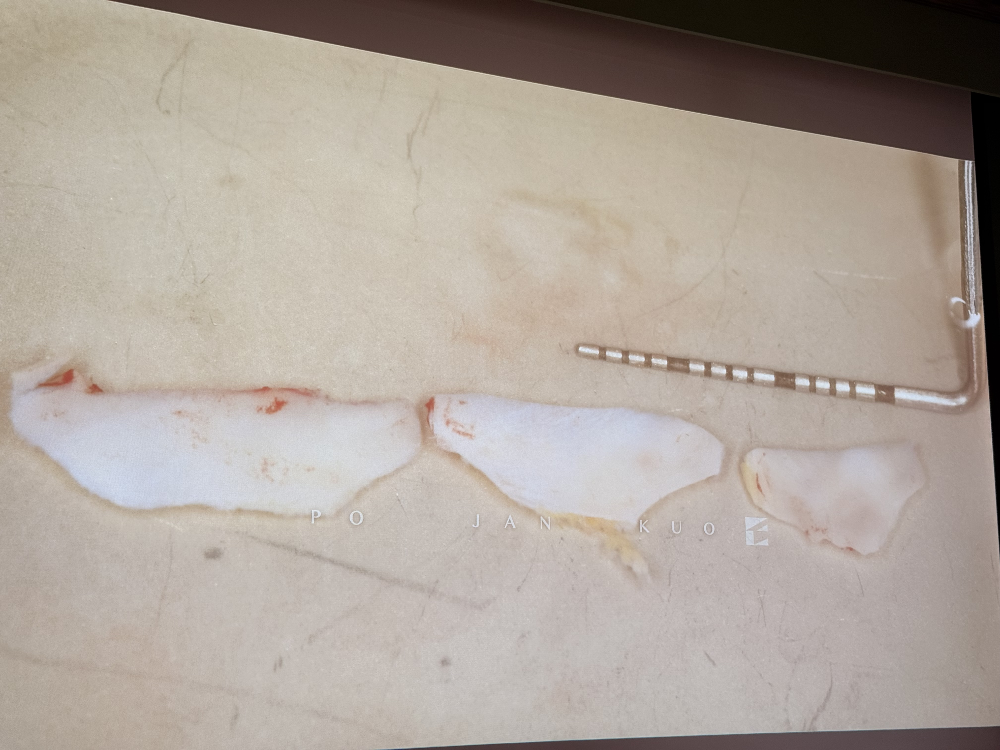

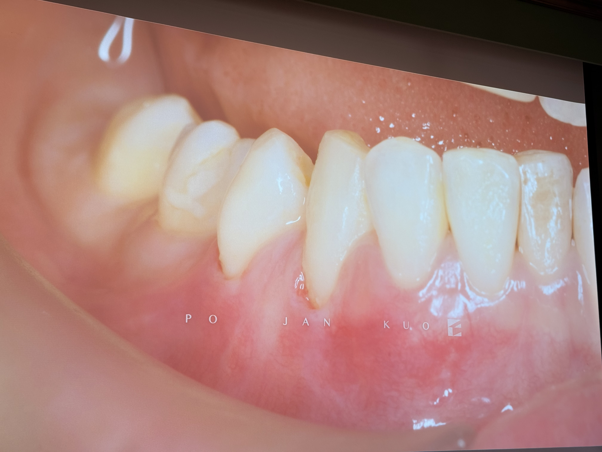

**【AI 精華整理】**

VIBE 的創新動機源於對既有術式的深刻反思。CAF（Coronally Advanced Flap）通過系統性的 flap 分層——surgical papilla（full thickness）→ mid-buccal（full thickness）→ mucosa（partial thickness）——建立了現代根面覆蓋的基礎。這套邏輯清晰高效，適合 RT1 處理。

然而，當面對 RT2/RT3（尤其是伴有 interdental attachment loss 的情況）時，CAF 遭遇瓶頸：
- **Papilla 無法有效冠向移進**：Papilla 高度喪失後，即使用力拉扯 flap，papilla 位置仍停留在原處，無法補償根間區的喪失。
- **Interdental blood supply 斷裂**：切割 papilla 時，其血供立即中斷，導致癒合延遲和預測性下降。
- **CTG 固定位置受限**：Papilla 消失後，CTG 的冠向錨定點消失，只能固定在接近 sub-crestal 的位置，結果是拆線時軟組織萎縮，CTG 隨之脫落。

Vista 代表了另一個極端：通過巨大的 flap elevation 和深層肌肉鬆解，將整個區域翻起來。這雖然提供了足夠的鬆弛度（tissue passivity），但代價是患者術後不適感顯著增加，因為整個深層結構被擾亂。

VIBE 的核心洞察是：**RT2/RT3 占臨床病例的 88%，不能放棄這些患者**。必須設計一套既能保留 papilla 完整性（維護血供），又能有效鬆解肌肉層（提供 tissue passivity）的術式。

**【完整潤色原文】**

在這個位置的時候，我們來提一下 CAF。因為時間的關係，我們是讓大家先把操作做完，才來講這 lecture。所以 CAF 把 flap 在目前來說我體會到，它把 flap 的分層，從 surgical papilla、mid-buccal 到 mucosa，做最好的解釋最好的分層。在以往我不知道我的 flap 在做什麼。特別是做 tunnel 的時候，我真的不知道我在幹什麼。

在 keratinized tissue 的區域我要 full thickness，在 mucosa 的位置，我要盡量薄到不行。所以這個位置是 surgical papilla，我的厚度要保留住，然後這是 full thickness，所以 full thickness 的位置，本來腳之外牙齦的血液循環就是線。而且它要貼在沒有血液循環的牙根上。上方的 mucosa 不要有 muscle tension free，提供血液循環。這就是 CAF 整套邏輯。

但是無論如何，為什麼會選擇 CAF？為什麼我那麼愛 CAF 或是我被它感動到的原因就是，它把 flap 的分層，從 surgical papilla、mid-buccal 到 mucosa，做最好的解釋最好的分層。

那有些醫師會想說，我為什麼不全部都 partial？為什麼不全部都 partial？因為這樣更鬆啊。但是以結論來說的話，或者在我的有限經驗上面，你都打 partial，技術難度很高之餘，在某些特殊位置根本辦不到。lower anterior，又薄又窄又多顆，在這種狀況下你打 partial，很快就 perforation。所以一樣，用這個方式做 full thickness，在 keratinized tissue 的位置，mucosa 打 partial 而已，它的 preview count 的機會比較高。

但是你看看 RT2 和 RT3 的狀況。RT2 就只剩 24、57，一年 22，一年 32.8。RT3 就是 0。所以當你的 interdental tissue loss 的時候，你的 CAF 就不會動啊。你打開了你也不會動啊。所以你用了 CAF，你就是要 follow 這樣子的結果。

我們不覺得 RT2、RT3 就是要 give up。所以我們一起來思考。因為我們剛才架構了很多 background knowledge，那些不是說我可以直接講 Vibes。所以你 RT2、RT3 的關鍵原則，你回來看就是 interdental tissue loss。

那接下來怎麼辦？我們就想了很多。我覺得今天要選的是，你的 RT2 和 RT3 是 88。我 409。如果你看牙齒的話 99%。所以意思就是說，我們花錢上了那麼多課，然後去環遊世界回來是，好像我滿足了一些什麼事情，然後有些事情沒有被滿足。又一大塊是空虛的。

那 vista 我跟大家講，我分享我的看法，叫做暴力解。什麼意思？我翻超大，所以原本是凹的對不對，把它變成凸出來的，拉下來就好了。是暴力解。你如果沒有做過 vista，你一定要叫你朋友做一次，然後問說，病人回來反應怎麼樣？我有做過幾個，病人的反應是蠻不舒服的。因為沒辦法，他整個要撐下來，整個要撐下來。所以你一定要把它做非常非常的大。沒辦法，他沒有去解決任何 muscle 的問題。他就全部底下纏起來。

**【本段重點】**

🔴 **臨床關鍵：** CAF 適合 RT1（papilla 完整），但面對 RT2/RT3（papilla loss + interdental attachment loss）時，預測性崩潰至 0-32.8%。Vista 是「暴力解」，過度侵襲。

⚡ **Clinical Pearl：** RT2/RT3 占臨床的 88%，不能放棄；必須設計既保留 papilla 血供又能有效鬆解肌肉的術式。

⚠️ **常見錯誤：** 在 RT2/RT3 患者身上堅用 CAF，期望不符結果失望；或盲目採用 Vista，導致患者術後不適。

💬 **學員問答：** 「RT1 用 CAF 就夠了，為什麼還要學 VIBE？」→「因為你 99% 的牙齒根本不是 RT1，RT2/RT3 才是臨床常態，它們需要不同的策略」。

📌 **延伸補充：** Paper 1 和 Paper 2 的研究結果直接對應郭醫師這裡提到的數據。Paper 2 明確指出，過去 CAF 治療 RT2/RT3 的 CRC 率僅 18.23% at 12+ 月，而 VIBE 達到 63.64%（Paper 2）乃至 87.5%（Paper 1）。這 40% 以上的進步，正是 VIBE 誕生的科學依據。

**【概念白話解析】**

1. **CAF 是優雅的刀具，但限在 RT1 領地**：它的分層邏輯完美，但 papilla 一旦消失，整套系統失效。

2. **Interdental Tissue Loss = CAF 的死穴**：Papilla 喪失後，沒有根間區的支撐和血供，任何冠向牽引都無法讓 papilla 重現。

3. **Vista 是推土機，有效但傷害大**：巨大 flap 確實鬆，但代價是患者不適和長期重塑，不符合現代微創理念。

**【自我測驗】**

Q1（回憶）：CAF 的 flap 分層包括哪三層？各層的厚度要求是什麼？
A1：surgical papilla (full) → mid-buccal (full) → mucosa (partial)。Full thickness 層要貼著牙根，partial thickness 層用來解除肌肉張力。

Q2（情境）：你看到一個 RT3 患者（root prominence + papilla loss + interdental CAL），用 CAF 操作。預測會發生什麼？
A2：Papilla 無法冠向移進，CTG 只能固定在 sub-crestal 位置，拆線時軟組織萎縮，CTG 脫落。最終 CRC ≈ 0%。

Q3（比較）：為什麼 VIBE 相比 Vista 是更優的選擇，儘管兩者都追求 tissue passivity？
A3：VIBE 保留 papilla 完整性（維護血供），只在肌肉層做有針對性的鬆解，患者術後不適感大幅降低。Vista 的「暴力解」翻動全層，導致患者不適並無必要。

---

### 段落 10：RT1、CM、Tunnel — 都要學 {影片 Part 1 115:00-130:00}

**主題標籤：** #RT1多方法 #clinical-decision #修改信念 #大師經驗 #protocol-flexibility

**相關概念：** 前置→手術比較(段落9); 延伸→術式選擇邏輯; 跨課程→臨床決策樹

**截圖：**
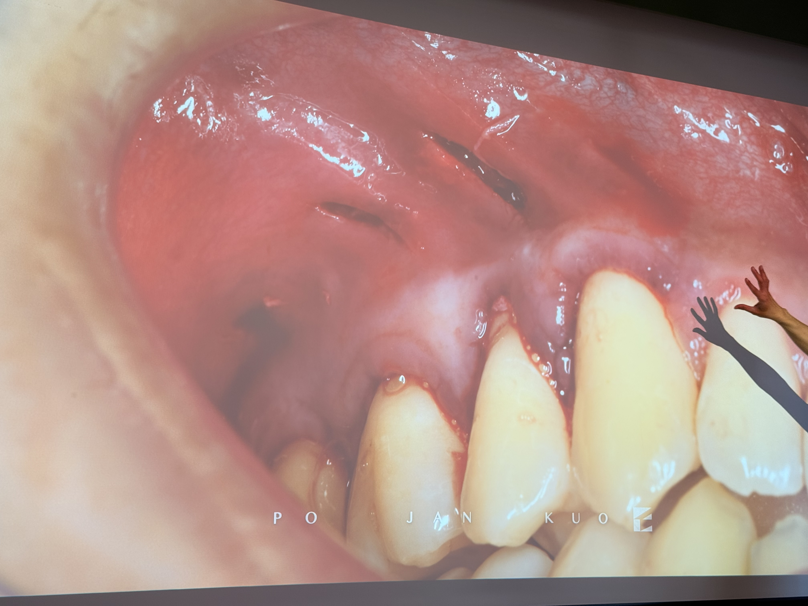

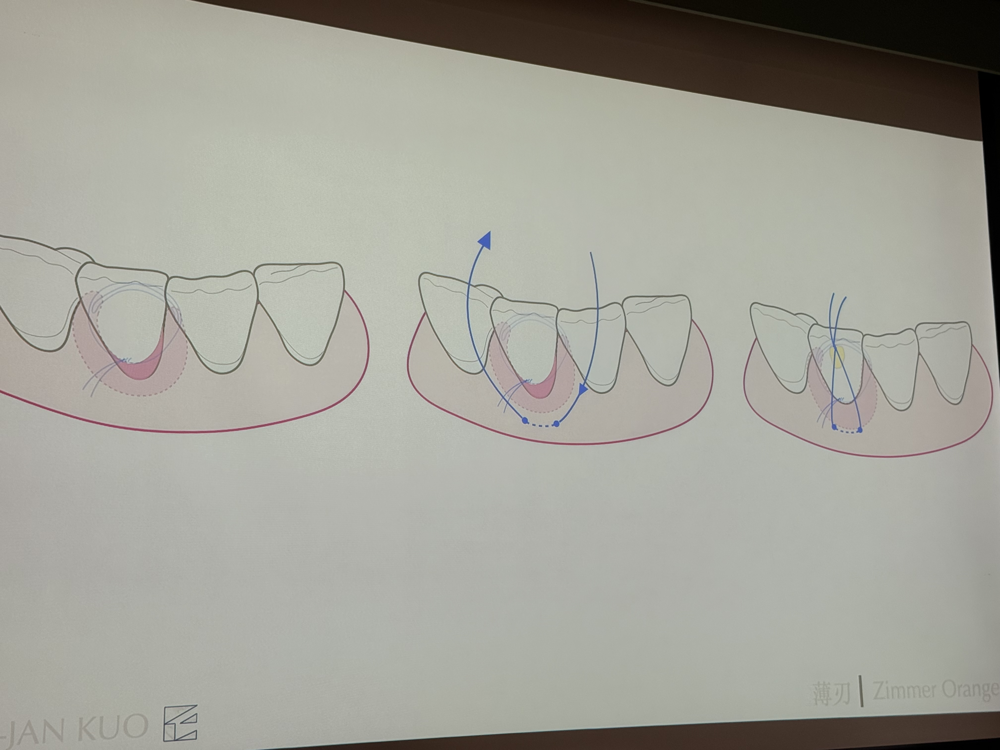

**【AI 精華整理】**

看似矛盾的教學方法，實則反映了郭醫師的務實臨床哲學：**RT1 沒有絕對的「最佳術式」，而是「都可以」**。

當患者 papilla 完整、interdental attachment 完整（RT1 定義），用 CM（Coronally Advanced with Modified flap）、tunnel、或經典 CAF，操作成功率都相當高。這是因為 RT1 的優越解剖條件——完整的支撐結構和血供——能夠容納多種技術路線。

Pat Allen（tunnel 的創始人）和 Sculean（現代 CAF 的推廣者）都驗證了這一點：RT1 時，papilla 夠強，無論是輕柔的 tunnel 還是有力的 CAF，都能成功。

**但這裡隱含的臨床洞察是核心：RT1 雖然「都可以」，但並非「都一樣」**。郭醫師強調：

1. **RT1 不是臨床大宗**（僅占 ~1-3%）
2. **RT2/RT3 才是真正的挑戰**（占 88% 以上）
3. **掌握多個術式的目的不是為了 RT1 加分，而是為了在 RT2/RT3 面前有充足的工具庫**

因此，醫師必須「都要學」——不是為了選擇，而是為了理解每個術式在 RT2/RT3 上的改良潛力。

**【完整潤色原文】**

那為什麼會選擇 CAF？為什麼我那麼愛 CAF？那各位醫師我問你喔，這個 RT1 你會用 tunnel 還是做 CAF？我們來看看，我們已經跟大家複習過了。那 tunnel 呢？Pat Allen 也告訴我說 OK，而且你不用 CTG，你用 graph 也可以，你只要把它弄鬆。但是可惜的就是，Pat Allen 對於 mucosa，他其實沒有講得很清楚。他有給你一套公式，可是那套公式我照著做，我會發現到 muscle 還在裡面。但沒有關係，你是 RT1，所以你先天條件的話，你這個沒有問題，你還可以蓋得很好。所以你用 tunnel 沒有問題。

Skoolium 也告訴你說，如果是 localized isolated peak recession，醫法說這個用 CF 比較好做。他說沒關係啊，你把它弄鬆之後中間給它關起來，把它關起來，也是可以。所以它做完也沒問題。

我沒有認真的說，如果這樣子做，可以換到超無想像的結果，我一定跟著做。我耗時費力了，我一定要怎麼樣，我槓桿已經開下去了。我一定要 double 的回饋。對不對？我槓桿已經開下去了，這個比較難，我已經冒風險了，你沒有加費的報酬，我不跟啊。沒股跳水了，我不跟啊。

所以如果耗時費力，我一定要有回饋。但是這個位置比較辛苦，比較不好做。然後如果大家有去追蹤，這兩位的演講的話，他會說你的 CTG，不要取完全 dense 的他們的 T 恤，你要取有點 sunny，做起來才漂亮。

但是無論如何，你也可以用這樣的方式做，沒有關係。當然是有趣的事情是，這些素事都滿足了，我的 papilla 高度很高，我的 contour 只要能夠夠鬆，鬆到我到 CEJ 的時候，張力不會太大，C 區可以固定好，沒差。你用什麼方式都沒有關係。

所以如果有巨人醫師問我說，這樣你推薦用 CM，還是用 tunnel？我說你可以寡規。你可以做你任何想做的，因為它就是 RT1。然後你說我要學什麼，我要學 CM，要學 tunnel。那我會跟你說你都要學。你今天只有一片 15C 的時候，你可以 CM。你經過 tunnel 醫學門的時候，你可以做 tunnel。你不能只學一個。

所以我們今天先把 CM，在這裡前兩天解決掉。但是如果是你看到這種 papilla 很好的，隨便，你想做什麼都可以。我說沒有關係，我就是 tunnel，我最喜歡 tunnel。你做起來不要，沒有關係就是 tunnel。我也沒逼你。我喜歡 CM，我覺得 CM 就是 CM。沒關係。它就是 RT1。

**【本段重點】**

🔴 **臨床關鍵：** RT1 可用多種術式（tunnel、CM、CAF），預測性都高（成功率 >90%）。問題不在 RT1 如何選，而在有沒有工具應對 RT2/RT3。

⚡ **Clinical Pearl：** 掌握多個術式不是為了 RT1 加分，而是為了理解其中的鬆解原理，從而改良應對 RT2/RT3。

⚠️ **常見錯誤：** 花費大量精力優化 RT1 術式，而忽視 RT2/RT3 才是臨床常態；或只學一種術式，喪失靈活性。

💬 **學員問答：** 「我 RT1 用 tunnel 就可以了，為什麼要學 CM？」→「因為 RT1 你用什麼都行，但當你面對 RT2/RT3 時，你需要理解每種術式的本質差異，才能創新改良」。

📌 **延伸補充：** Pat Allen 和 Sculean 都在論文中驗證了各自術式在 RT1 上的成功率，印證了「RT1 既往多方法可行」。但關鍵是，他們的論文多數只涵蓋 RT1 患者，或避談 RT2/RT3 的失敗率。VIBE 的價值正在於填補這一空白。

**【概念白話解析】**

1. **RT1 = 安全區，多方法都行**：完整的 papilla 和 attachment 是最好的「保險」，任何合理的術式都能成功。

2. **不要為 RT1 浪費精力優化**：RT1 本來就簡單，真正需要精力的是 RT2/RT3。

3. **多方法學習的目的是遷移，不是選擇**：學多了不是為了在 RT1 上「選最優」，而是為了在 RT2/RT3 上「創新改良」。

**【自我測驗】**

Q1（回憶）：RT1 的解剖特點是什麼？使其能容納多種術式？
A1：Papilla 完整、interdental attachment 完整、血供充沛。這些優勢使得任何合理的皮瓣設計都能成功。

Q2（情境）：你是初學者，已掌握 CM 技巧，看到一個 RT1 患者 papilla 良好。郭醫師會建議你怎樣做？
A2：「用 CM 就好，不用管別人的 tunnel。但當你以後面對 RT2/RT3 時，回過頭來學 tunnel 的原理，會發現新的啟發」。

Q3（比較）：為什麼郭醫師說「要學 CM，也要學 tunnel」而不是「選一個就好」？
A3：因為每種術式體現了不同的生物力學和血供邏輯。多學幾個，才能在 RT2/RT3 上融合、改良，創造 VIBE 這樣的創新術式。

---

### 段落 11：VIBE 核心理念與器械選擇 {影片 Part 1 130:00-148:00 + Part 3 00:00-20:00}

**主題標籤：** #interdental-tissue-loss #VIBE-philosophy #器械選擇 #小黃刀 #sling-suture概念

**相關概念：** 前置→RT2RT3挑戰(段落9-10); 延伸→切口設計; 跨課程→根間區重建

**截圖：**
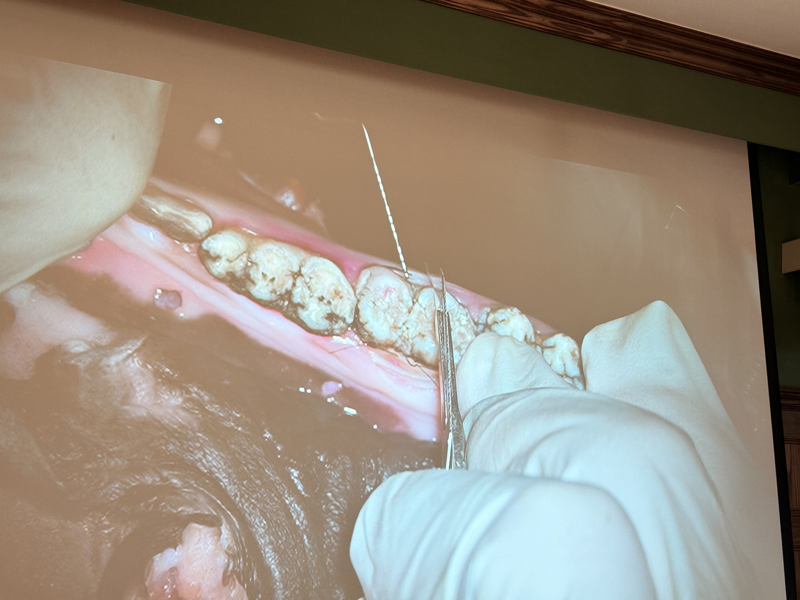

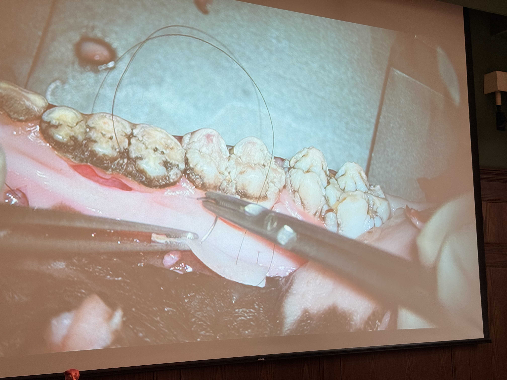

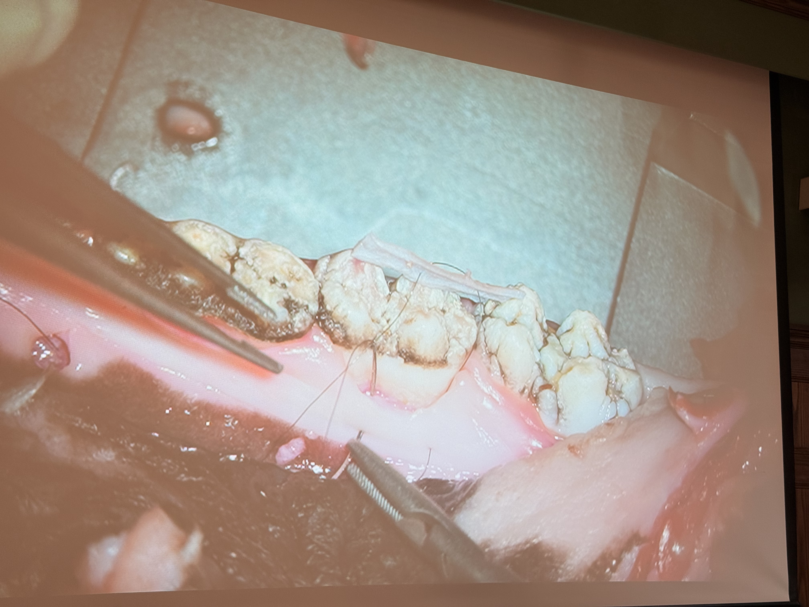

**【AI 精華整理】**

VIBE 的命名（**Vi**tal **B**one and Soft Tissue **E**nhancement）準確反映了其核心理念：**同步解決 buccal 面和 interdental 區的軟組織重建**。

**為什麼 VIBE 的誕生不可避免**？因為 RT2/RT3 患者身上存在一個根本的解剖缺損：interdental tissue loss。當根間區的 papilla 和 attachment 喪失時，傳統的冠向推進（coronal advancement）無法補償——papilla 位置已經改變，血供已經中斷，CTG 的錨定點消失。

VIBE 的四大核心原則：

1. **Papilla 不能切開**：保留或重建 papilla 完整性，維護血供。
2. **Mucosa 要很鬆、沒有肌肉**：通過特殊的 flap design 和肌肉解除，確保 tissue passivity。
3. **Attached gingiva 要 full thickness**：keratinized tissue 層必須完整，維持長期穩定。
4. **Interdental 全部要撐起來**：sling suture 不僅在 buccal 固定 CTG，更在根間區用一針穿過 interdental 區，創造空間讓軟組織站起來。

**器械選擇的務實考量**：郭醫師採用「小黃刀」（45C 刀）而非昂貴的顯微鋼片。為什麼？因為關鍵不在工具名貴度，而在操作邏輯。小黃刀足以達成必要的精確度，價格更優（250 vs 450），讓更多醫師能夠採用。

**Sling Suture 的三維作用**：
- **Buccal 固定**：CTG 在 buccal 牙根表面的冠向位置穩定。
- **Interdental 支撐**：在根間區穿一針，把 interdental tissue 從下往上撐，創造重建空間。
- **Collagen 充填**：在撐起的空間內放置 collagen，促進軟組織增生。

**【完整潤色原文】**

所以為什麼會有今天的課程出來？就是我不覺得，我們不覺得 RT2、RT3 就是要 give up。所以我們一起來思考。因為我們剛才架構了很多 background knowledge，那些不是說，我可以直接講 Vibes，沒有問題。可是你會不知道，你會覺得，中間好像若有事。

今天 RT2、RT3 的關鍵原則，你回來看就是 interdental tissue loss。所以你 interdental tissue loss 的時候，你回去看，它的 complete recovery ratio，RT2 就只剩 24、57，一年 22，一年 32.8。RT3 就是 0。

所以意思就是說，我們花錢上了那麼多課，然後去環遊世界回來是，好像我滿足了一些什麼事情，然後有些事情沒有被滿足。又一大塊是空虛的。

講這麼多，我們已經知道，我們的弱項在哪裡。我需要有，今天練習就是兩個部分，一個是 flat preparation，一個是我的 gram 的固定。那這兩個問題都在解決，我的 inter-dental 已經不見了。所以我的 flat preparation 要幹嘛？

我的 papilla 不能切開。然後，我的 mucosa 要很鬆沒有 muscle。我的 attach g-value 要 full thickness。然後連 inter-dental 全部要撐起來。這樣子，我就不只有 buccal 有 space，我的 inter-dental 也有 space。

可是我們的第一個目標，你做到這個方式之後，你只要，你只要願意，用 sling suture 在 inter-dental。然後 inter-dental 位置你才會帶一針。你上面放 collagen，你的 flat 會跳到跟抗原，貼在一起。

我們其實一開始最早突破的是這一塊。因為你除非你掌握這些要素之後，就很鬆了。可是一直沒有辦法很好，底下都是 blot triangle，都是 dead space。然後你沒有一個很好的方式，把 cg 放進去。

所以今天就是，這些就是，就是這些壞人。我們的弱項在哪裡。我需要有，我們的第一個目標就是，小黃刀。你要放大工具。然後中間的操作，為什麼會希望大家說，我會帶大家每一步，每一步該怎麼做。因為你把 trauma 減少的時候，體力才會好。體力才會好。所以今天就是。

**【本段重點】**

🔴 **臨床關鍵：** VIBE = 四層次整體設計：papilla 保留 + mucosa 鬆解 + attached gingiva 全厚 + interdental 撐起。缺一不可。

⚡ **Clinical Pearl：** Sling suture 不只在 buccal 固定 CTG，更在 interdental 用一針撐起軟組織，創造空間讓 collagen 充填和軟組織再生。

⚠️ **常見錯誤：** 只著眼 buccal recession coverage，忽視 interdental 區的同步重建；或盲目追求昂貴器械，忽視操作邏輯。

💬 **學員問答：** 「為什麼要特別在 interdental 放一針？」→「因為根間區是 RT2/RT3 的死穴。普通冠向推進無法補償。sling suture 在這裡撐起組織，才能重建」。

📌 **延伸補充：** Paper 1 和 Paper 2 都詳細記錄了 supra-crestal sling suture（SCS）在 interdental 區的三針固定法（buccal + proximal + 底部支撐），直接印證了郭醫師這裡提到的 interdental sling concept。Paper 2 的 22 個病灶中，所有使用 SCS 的 RT2/RT3 都達到 >90% mean root coverage，正是因為 interdental support 的有效性。

**【臨床決策樹】**

```
軟組織缺損評估
├─ RT1（papilla 完整）
│  └─ → CAF、tunnel 都可，預測性 >90%
└─ RT2/RT3（interdental tissue loss）
   ├─ Papilla 不能切開
   │  └─ → 保留或重建 papilla 完整性
   ├─ Mucosa 要鬆
   │  └─ → 肌肉層分離，確保 tissue passivity
   ├─ Attached gingiva 要 full thickness
   │  └─ → keratinized tissue 層必須完整
   └─ Interdental 要撐起
      └─ → sling suture 穿過根間區，CTG 在此充填
```

**【概念白話解析】**

1. **Interdental Tissue Loss = 根本問題**：不是 buccal 根面露出，而是根間區的解剖改變。傳統術式無法應對。

2. **四層次缺一不可**：就像房子，缺任何一個支柱都會坍塌。VIBE 正是通過四層次的同步解決，才達到 RT2/RT3 的突破。

3. **Sling Suture 是樞紐**：它不是普通的固定線，而是一個立體的支撐系統，在 buccal、proximal、interdental 多處發揮作用。

**【自我測驗】**

Q1（回憶）：VIBE 的四個核心目標是什麼？
A1：(1) Papilla 不能切開 (2) Mucosa 要很鬆、沒有肌肉 (3) Attached gingiva 要 full thickness (4) Interdental 全部要撐起來。

Q2（情境）：你正在做一個 RT3 患者，已經完成 flap preparation。現在要放 CTG。根據 VIBE，你在 interdental 區應該怎樣操作？
A2：除了 buccal 的主 sling suture 外，還要在 interdental 區穿一針，把軟組織從下往上撐，創造空間，然後在此空間內放置 collagen 或 CTG 片，促進軟組織再生。

Q3（比較）：為什麼 VIBE 的 interdental sling suture 比傳統的 buccal-only CTG 固定更有效？
A3：傳統做法只在 buccal 牙根表面固定 CTG，根間區仍是 dead space（沒有支撐、沒有血供）。VIBE 的 interdental sling 把根間區從下往上撐起，為軟組織再生創造了條件，這是 RT2/RT3 突破的關鍵。

---

### 段落 12：CTG 放置步驟 — Mesial Incision Protocol {影片 Part 2 00:00-10:00}

**主題標籤：** #mesial-incision #CTG放置 #公式化操作 #distal-compact固定

**相關概念：** 前置→VIBE核心理念(段落11); 延伸→縫合技巧; 跨課程→器械應用

**截圖：**
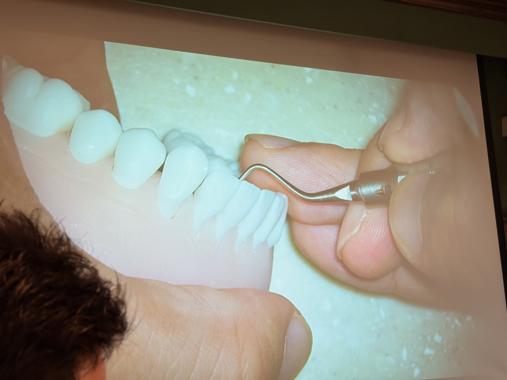

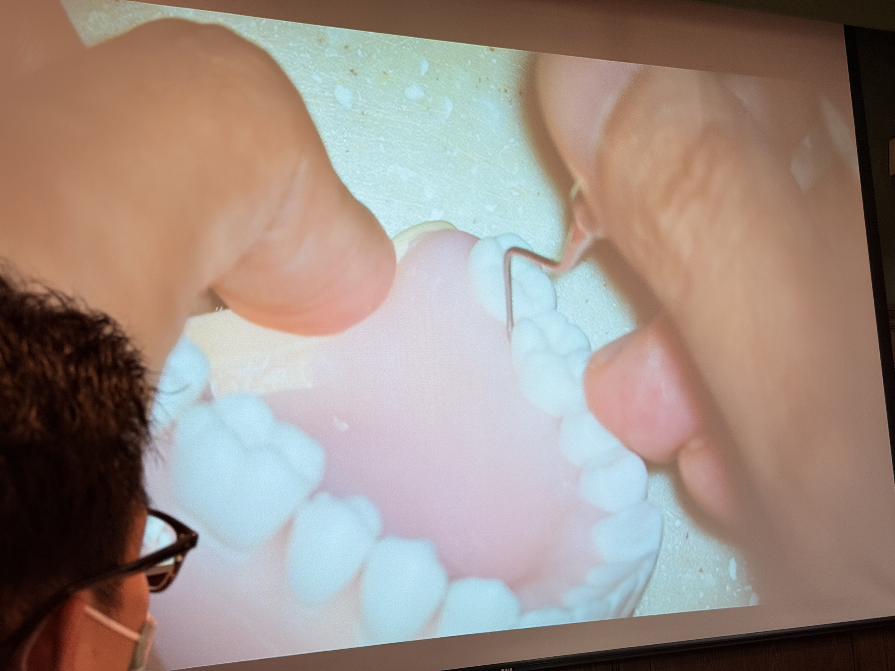

**【AI 精華整理】**

VIBE 的手術步驟堅持「公式化」（protocolized）操作，以降低學習曲線、提高重現性。CTG 放置的 mesial incision protocol 正是這種精確化思維的體現。

**Mesial Incision 的選擇原則**：
- 從 mesial 方向進入，避免從 distal 直接插入（易造成 CTG 位置不當或穿過 distal 區織物）。
- Mesial incision 提供了更自然的 approach angle，減少了器械和 CTG 運動時的組織創傷。

**CTG 的初始放置位置**：
- CTG 的 mesial 端先貼近 mesial incision 位置，建立錨點。
- 通過從 distal compact 進入的縫線，把 CTG 固定在 distal 側，形成一個「mesial anchor → distal fixation」的穩定構型。

**為什麼選 Distal Compact 進入？**
- Distal side 的 bone 和 tissue 較為緊湊（compact），穿線時不易穿過不該穿的區域。
- Mesial 方向則相對寬鬆（因為 mesial incision 的存在），如果從 mesial 進縫線，易造成穿線亂序。
- 因此，縫線策略是「mesial anchor，distal entry」——視覺上看是反向的，但這正是確保 CTG 位置準確的秘訣。

**【完整潤色原文】**

請大家，我們有兩邊，對不對？先用一邊，你現在就照你想的事，我們就是要把 CTG 掛到上面去。

我建議大家，你就是在任何一個位置，你心中放一塊 CTG，放一塊 CTG，然後把線穿進去。稍微畫一下，縫合好，反正縫合好就是打怎麼樣，就繞上去。

我要選擇拿一個切線進去，放進去。我的 CTG 像我以這顆牙齒來講，它有 distal 也有 mesio 的切線。我要從哪一個窗口進去？

我要選擇 mesio incision。選擇 mesio incision。

我要放 mesio 之後，我的 CTG 要先擺在，這一個切 mesio incision 的，mesio side distal size。覺得 mesio size 請舉手。OK，為什麼我要這樣做呢？我要讓大家，每一顆牙齒來做的時候，都是公式化。我要選擇 mesio incision，mesio incision 開始，我們這邊要進去。接下來 CTG 要放置了。我 CTG 放置，大家放 mesio distal，我們要變成同一個，同一個 program。

所以我的縫線呢，我的縫線，接下來我就說我的方式，然後我會解釋為什麼，我會這樣做。然後你再回頭看，這個縫線，先從 distal compact 進來，然後進 suckers，出來之後，catch grab the distal size。然後再回去，都用線，然後這個才做針頭，再出來。

**【本段重點】**

🔴 **臨床關鍵：** Mesial incision protocol 確保 CTG 位置一致、操作重現性高。「Mesial anchor + Distal entry」是關鍵邏輯。

⚡ **Clinical Pearl：** CTG 放置看似簡單，但穿線順序和進入位置直接影響最終位置準確性。公式化操作消除了猜測。

⚠️ **常見錯誤：** 從 mesial 方向直接穿線進入，導致 CTG 位置偏移；或缺乏一致的穿線順序，每個病例操作不同，可重現性差。

💬 **學員問答：** 「為什麼要從 distal compact 進，不直接從 mesial？」→「因為 mesial 比較寬鬆（有 incision），縫線易亂。distal 比較緊湊，穿線軌跡清晰，CTG 位置才準確」。

📌 **延伸補充：** Paper 1 和 Paper 2 的手術記錄中，都詳細描述了 CTG 的放置順序和進入位置，正是這裡提到的 mesial incision protocol 的臨床驗證。這種公式化做法是 VIBE 可高度重現、結果可預測的基礎。

**【概念白話解析】**

1. **Mesial Anchor = 第一個穩定點**：就像釘釘子，先釘 mesial 端，其他才有基準。

2. **Distal Entry = 反向思維**：直覺上從 distal 進似乎遠，但實際上 distal 的「緊湊」讓穿線更準確。

3. **公式化 = 可教育、可重現**：同樣的步驟，不同醫師做出的結果相似，這是 protocol-based 手術的力量。

**【自我測驗】**

Q1（回憶）：CTG 放置時，為什麼要從 mesial incision 進而不是 distal？
A1：Mesial 方向作為初始錨點，能建立 CTG 位置的基準。後續從 distal compact（緊湊區）穿線，確保路徑清晰、位置準確。

Q2（情境）：你正在做一個前牙區的 RT3，已完成 flap prep。現在要放置一塊 1.5mm 厚的 CTG。按照 mesial incision protocol，你的第一步動作是什麼？
A2：從 mesial incision 進入，把 CTG 的 mesial 端貼近 mesial incision 位置，建立錨點。然後準備從 distal side 穿線固定。

Q3（比較）：為什麼郭醫師強調「公式化」而不是「隨機應變」？
A3：公式化確保重現性。不同醫師、不同患者，遵循相同的步驟，結果相似。這才是教育和進步的基礎。隨機應變會導致結果差異大，無法總結經驗。

---

### 段落 13：縫合技巧 — Supra-Crestal Sling Suture 與拉線要訣 {影片 Part 2 10:00-21:00}

**主題標籤：** #suture技巧 #U-suture-J-suture #supra-crestal-固定 #拉線邏輯 #結打位置

**相關概念：** 前置→CTG放置(段落12); 延伸→傷口癒合; 跨課程→手術精確性

**截圖：**
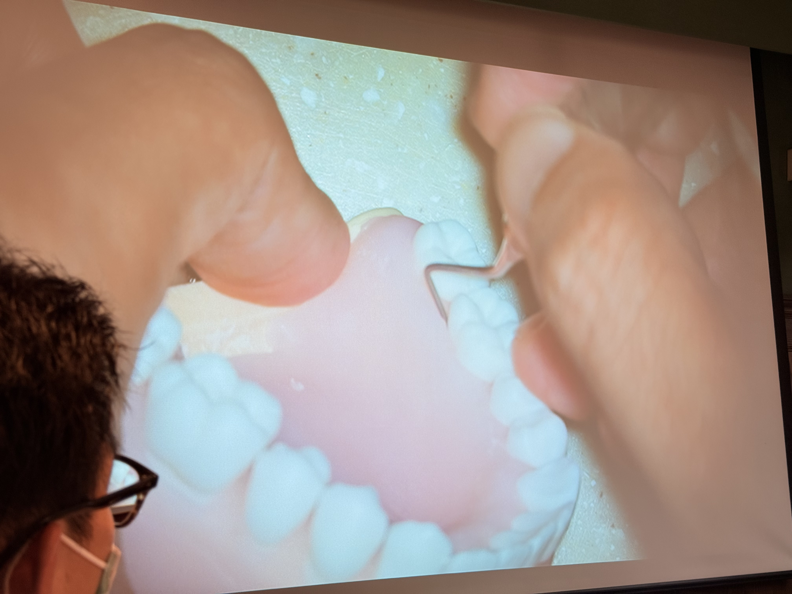

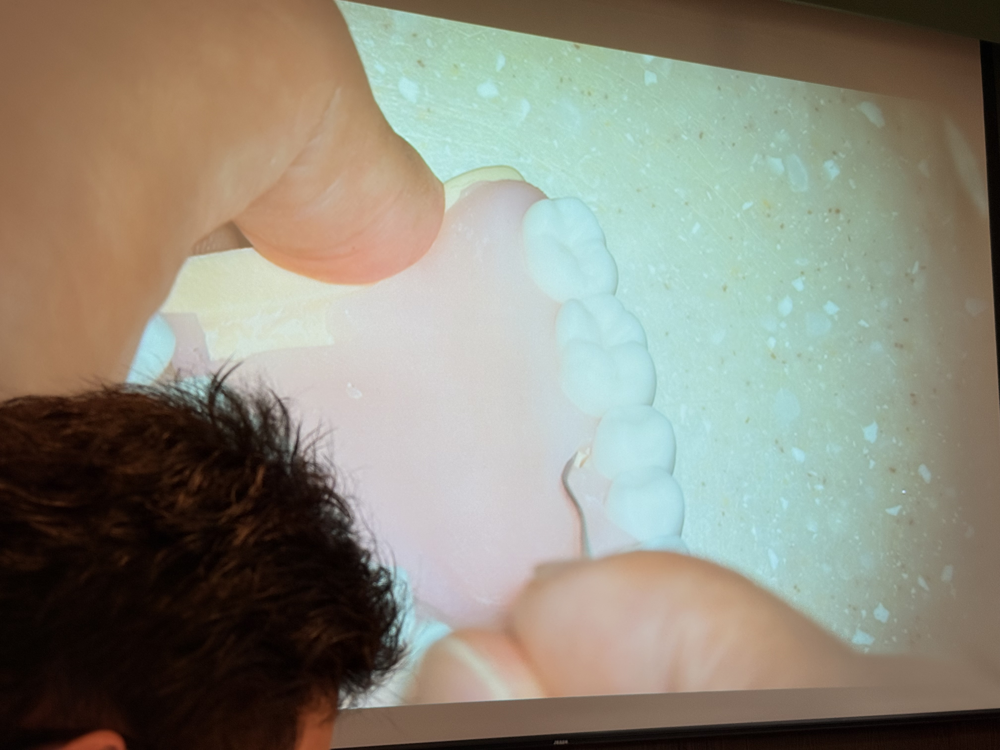

**【AI 精華整理】**

縫合是整個 VIBE 手術中最考驗手眼協調和空間感的步驟。郭醫師的教學方法是先讓學員在紙上或模型上演練，理解每根線的路徑，才上臨床。這反映了 VIBE 對精確性的執著。

**U Suture vs J Suture：本質相同，方向不同**
- **U Suture**：線的走向呈 U 形。
- **J Suture**：線的走向呈 J 形（更適合前牙區的狹窄空間）。
- 在 VIBE 中，兩者的穿線序列完全相同，只是拉線時的方向不同。關鍵是理解**每根線在三維空間中的路徑**。

**五步穿線邏輯**：

1. **Distal compact entry**：從 distal 緊湊區進入，這是第一根線的起點。
2. **穿過 CTG（上側）**：針從 CTG 上方穿過。
3. **穿過 CTG（下側）**：同根線再穿過 CTG 下方，形成「夾著 CTG」的效果。
4. **Catch distal side**：穿出後夾住 distal incision 邊的軟組織或上層 flap。
5. **回到起點形成迴路**：線走到這裡時，第 1 和第 4 端已經形成一個完整的迴路。

**為什麼結要打在 Buccal Side？**
- Buccal side 結打完後，眼睛能直接看到 CTG 的位置和 flap 的覆蓋狀況。
- 同時能監控 sling suture 在根間區（interdental）的支撐是否到位。
- 如果結打在 lingual side，後期調整空間有限。

**「5 跟 6 分開拉」的要訣**：
- 牙齒 #5 和 #6 如果相鄰，它們的根間區需要分開的 sling suture support。
- 不能用一根線同時拉動兩個牙齒的根間區。
- 每個牙間隙一根線，才能精確控制每個根間區的軟組織位置。

**Instrument Push-In 技巧**：
- 在 CTG 固定後、flap 即將覆蓋前，用專用的 instrument（如 mouth mirror 背面或平面探針）輕輕推入 CTG 和 flap 之間的空隙，確保 CTG 貼服於牙根，flap 完全覆蓋。
- 這個動作減少了術後 flap 萎縮時 CTG 暴露的風險。

**【完整潤色原文】**

我們就是要把 CTG 掛到上面去。大家先用左手邊，我給大家三、五分鐘，你掛一下你心中的 future，把它掛起來這樣子。一個 U，我們就這個 U 在這裡。

我建議大家，你就是在任何一個位置，你心中放一塊 CTG，放一塊 CTG，然後把線穿進去。稍微畫一下，縫合好，反正縫合好就是打怎麼樣，就繞上去。然後我把我的再跟大家講一次。然後你會發現到說，為什麼我這樣子做，我要這樣子建議大家。那你才有辦法在下一個，真正在模型上面，在代線的時候，腦海中才會深刻。

不管說這個是 U 還是 J，反正 U 跟 J 做的方式都是一樣的。線都一樣，拉的方向不一樣。

我們的第一個問題是，我的 CTG，我要選擇拿一個切線進去，放進去。我的 CTG 像我以這顆牙齒來講，它有 distal 也有 mesio 的切線。我要從哪一個窗口進去？覺得會選擇 distal 的請舉手。覺得從 mesio 送進去，比較輕鬆的請舉手。太棒了，我要選擇 mesio。選擇 mesio。

現在下一個問題是，我要放 mesio 之後，我的 CTG 要先擺在，這一個切 mesio incision 的，mesio size distal size。覺得 mesio size 請舉手。覺得在 distal size 請舉手。OK，為什麼我要這樣做呢？我要讓大家，每一顆牙齒來做的時候，都是公式化。我要選擇 mesio incision，mesio incision 開始，我們這邊要進去。

所以我的縫線呢，我的縫線，接下來我就說我的方式，然後我會解釋為什麼，我會這樣做。然後你再回頭看，這個縫線，先從 distal compact 進來，然後進 suckers，出來之後，catch grab the distal size。然後再回去，都用線，然後這個才做針頭，再出來。這一步有沒有什麼問題？

那你從下面穿，再從上穿下去。從上穿下去，這應該是虛線，是 grab 的底下。通通可以，都可以。沒有差別。但是通常我是喜歡，從上往下穿，因為我的手的關係。你往上穿到這樣子，你要旋轉這樣，我不喜歡。我喜歡，我的手的管護動作，都是這個樣子。所以我會從上穿下。我習慣這樣子。OK，接下來出來之後，下一步。下一步呢，我會做一件事情，我會把 grab，移到 distal size 去。移到 distal size 去。這個縫線就會被卡在這個邊邊。可以嗎？沒有錯吧？好。

這個步對我來講，現在非常非常重要。因為你把它移過去之後，你這裡有一個 save zone。要不然你縫線竟然，撥到這裡，再見了，這一局再見了，你整個全部拆掉重來。所以這個位置，我等一下會給大家一個動作，我把它拉過來之後，我的線是不是線我在照顧這個 contact？對不對？照顧這個 contact？我在穿線，從這邊出來之後，我的鑷子會直接把這裡夾住撥開，所以你的針在走第三第四步驟的時候，沒有機會去干擾一跟二。

所以我會夾著，先把它穿過去之後，catch 這一邊，然後 catch 完之後，我的鑷子會再把這邊夾著，從這邊出來。可以嗎？我們是有這樣的概念。接下來呢，把一跟四交叉，你就可以綁起來了。為什麼要把結打在 buccal side？為什麼不打在另一 buccal side？somehow 可以。但是重點是什麼呢？也好打結。這也是關鍵。關鍵就是在於說，你在打結的同時，你在拉線的同時，你眼睛就可以看你的 grab。

你可以發現這是之前的案例。所以我沒有每個 indentive 都切，我沒有每個 indentive 都切。但是真的是不好做。所以後續就是乾脆每個 indentive，我都切一刀，我都切一刀。

**【本段重點】**

🔴 **臨床關鍵：** Sling suture 的五步穿線邏輯缺一不可。結打在 buccal side 能同時監控 CTG 位置和 interdental support。

⚡ **Clinical Pearl：** 針的走向看似複雜，但一旦理解了三維空間邏輯，就變成了可重複的、精確的動作。演練是關鍵。

⚠️ **常見錯誤：** 穿線順序錯亂導致 CTG 位置不當；結打在 lingual 側無法監控效果；或每個根間隙用同一根線，導致支撐不均。

💬 **學員問答：** 「為什麼要在紙上先畫？」→「因為臨床操作空間小、速度要快。先在紙上理解每根線的三維路徑，臨床才不會亂」。

📌 **延伸補充：** Paper 1 和 Paper 2 都詳細記錄了 supra-crestal sling suture（SCS）的穿線步驟和結打位置。特別是在根間區（interdental）的 multiple sling sutures 應用，Paper 2 提到在 22 個病灶上使用了多根 sling sutures，每個牙間隙一根，正是郭醫師這裡強調的「5 跟 6 分開拉」的臨床體現。

**【臨床決策樹】**

```
縫合步驟決策
├─ 選擇進入位置
│  └─ → Distal compact（緊湊區）為入口
├─ CTG 初始位置
│  └─ → Mesial anchor point 建立基準
├─ 穿線序列（5 步）
│  ├─ 步驟 1-4：從 distal 進、穿 CTG、catch distal side
│  └─ 步驟 5：回到起點形成迴路
├─ 結打位置
│  └─ → Buccal side（能直接監控）
└─ 根間區支撐
   └─ → 每個牙間隙獨立一根 sling suture
```

**【概念白話解析】**

1. **五步穿線 = 空間裡的舞蹈**：每根線都有自己的軌跡，理解了軌跡，臨床才不會迷失。

2. **紙上演練 = 認知負荷轉移**：在紙上理解邏輯，臨床就能快速執行，不需在患者嘴裡邊想邊做。

3. **Buccal side 結打 = 視覺回饋**：醫師能同時看到 CTG 位置、flap 覆蓋、interdental support，完整掌握局面。

**【自我測驗】**

Q1（回憶）：Supra-crestal sling suture 的五步穿線邏輯是什麼？
A1：(1) Distal compact 進入 (2) 穿 CTG 上方 (3) 穿 CTG 下方 (4) Catch distal side (5) 回到起點形成迴路。

Q2（情境）：你正在縫合一個前牙區 RT3，相鄰的 #8 和 #9 每個根間隙需要 sling suture。根據郭醫師的教學，你應該怎樣做？
A2：用兩根獨立的 sling sutures，每個牙間隙一根。不能用同一根線同時支撐兩個根間隙，否則控制不精確。

Q3（比較）：為什麼結要打在 buccal side 而不是 lingual side？
A3：Buccal side 結打後，眼睛能直接看到 CTG 位置、flap 覆蓋狀況和 interdental support 是否到位，能即時調整。Lingual side 則無法直視，後期調整空間有限。

---

## 模組四：進階應用 — 多顆處理與 Papilla 重建

### 段落 14：多顆牙齒的 VIBE 處理 {影片 Part 3 20:00-40:00}

**主題標籤**：#多顆牙齒 #延伸切口 #CTG-sizing #U-J-pattern #wrap-around #partial-thickness-tunnel

**相關概念**：
- 多顆根覆蓋的手術擴展邏輯
- CTG 的尺寸計算方式（U-shape vs U-J-J-J pattern）
- PFT tunnel 在多牙處理中的應用
- Tension source analysis（肌肉、神經血管束、瘢痕組織、乳頭狀突起）
- "Scar eraser effect"（partial thickness dissection 的消疤特性）

**截圖**

| 位置 | 說明 |
|------|------|
| 投影片 0025 | 多牙處理的切口設計 — 延伸邏輯示意 |
| 投影片 0026 | PFT tunnel 在多牙情況的層次結構 |
| 投影片 0027 | CTG 尺寸計算：U-shape vs U-J-J-J |
| 投影片 0028 | Tension source map — 影響因素全景圖 |

**【AI 精華整理】**

多顆牙齒的 VIBE 處理核心在於**層次化延伸**（layered extension）與**CTG 尺寸的模組化設計**：

1. **切口擴展邏輯**：
   - 第一顆牙：單一 vertical incision at interdental area
   - 第二、三顆：延伸一顆再超過一點點，每個 interdental 都切開（"每一個 interdental 你都切開"）
   - 多顆 vestibular incisions 連結方式："打地鼠"概念 — 在 gingival line 上下方打穿孔點，然後連結

2. **PFT tunnel 在多牙的應用**：
   - 起點：從 mucosa 開始，partial thickness 淺層切割
   - 深層切割：at mucogingival junction (MGJ) 處進行深層 full-thickness dissection
   - 功用：避免完全分層的 dead space，同時提供足夠的 scar eraser effect（部分厚度解剖會消除瘢痕）

3. **CTG 尺寸模組化**：
   - 基本原則：1mm 厚、4mm 寬度
   - Single tooth：U-shape（單一彎曲）
   - Multiple teeth：U-J-J-J pattern（U 形開口處，然後三個 J 分別進入三個 interdental spaces）
   - 取材策略：8mm 寬的 palate graft → 一刀切半 → 兩個 4mm 寬的 pieces

4. **Tension assessment（四大張力來源）**：
   - Palatal tissue innervation（腭側組織的神經血管束張力）
   - Periosteum attachment（骨膜附著）
   - Muscle attachment（肌肉牽張）
   - Scar tissue & neurovascular bundle（瘢痕與舊的神經血管）
   - Interdental papilla contour（牙間乳頭輪廓張力）

5. **多牙 vs 單牙的風險差異**：
   - 單牙：tension 來源單純
   - 多牙：needs holistic assessment，每個 interdental area 都可能有不同的 tension pattern
   - PFT + layered dissection：降低 tension accumulation

**【完整潤色原文】**

郭醫師在講授多顆牙齒的 VIBE 處理時，強調了一個核心觀念：**"延伸不是無限延伸，而是有邏輯的層次化擴展"**。

他舉例說明："當你做到第二顆、第三顆的時候，你並不是把整個 ridge 都剝開。你只是延伸一顆再超過一點點。關鍵是每一個 interdental，你都要切開。"這不是傳統 CAF 的連續線性切割，而是**多個獨立的 vertical incisions 相互支撐的系統**。

在 vestibular incisions 的連結上，郭醫師用了一個形象的比喻："就像打地鼠一樣"。你不是一刀從上到下割開，而是在 gingival line 上下方打穿孔點，然後用穿孔連結它們。這樣的做法有幾個優勢：
- 保留更多的血液供應（每個穿孔點周圍保留血管）
- 減少不必要的 denudation（裸露區域）
- 便於後期調整和重新評估

**PFT tunnel 在多牙情況的應用**上，郭醫師提到了一個細微但重要的技巧：起點總是從 mucosa 開始，進行 partial thickness 的淺層切割。當到達 MGJ（mucogingival junction）時，才轉換為深層的 full-thickness dissection。這個設計的目的在於：
1. 避免在整個 tunnel 中都做 full-thickness dissection，導致完全分層的 dead space
2. 利用 partial thickness dissection 的特性來消除瘢痕組織（"scar eraser effect"）
3. 在 attached gingiva 區域維持全厚度，以保留其附著特性

**CTG 尺寸的計算**則進化到了**模組化設計**：
- 基礎寬度統一設定為 4mm（經過多年臨床驗證）
- 厚度始終 1mm（不厚不薄，易於操作和成活）
- Single tooth 用 U-shape，opening 朝 vestibular side
- Multiple teeth（比如三顆前牙）則用 U-J-J-J pattern：主 U 形的 opening 在 vestibular，然後三個 J-shaped extensions 分別進入三個 interdental spaces

取材的實際操作也很有講究："我們從 palate 取 8mm 寬的 graft。一刀切下去，中間再切一刀，就變成兩個 4mm 的 pieces。"這樣既滿足了尺寸的精準性，也簡化了取材流程。

**Tension assessment** 是多牙處理的靈魂部分。郭醫師列舉了所有可能的張力來源：
- 腭側組織的 innervation — 神經血管束會產生神經反射性的張力
- Periosteum 的附著 — 骨膜如果沒有充分解剖會強烈牽張
- Muscle attachment — 肌肉牽張是最難克服的
- Scar tissue 和舊的 neurovascular bundle — 既有的瘢痕和陳舊組織的粘連會限制移動
- Interdental papilla 的輪廓 — 乳頭狀突起的解剖直接影響術後美觀

他強調了一個重要的比較："如果你只做 CAF（conventional approach），你根本看不到所有的 tension sources。但 PFT tunnel 加上 layered dissection，你能逐層評估和處理每一個張力來源。"

**【本段重點】**

🔴 **關鍵觀念**：多牙處理不是線性延伸，而是層次化的多點支撐系統。每個 interdental 都需要獨立評估和處理。

⚡ **技術核心**：
- Vertical incisions at each interdental area
- "地鼠式"vestibular incision connections
- PFT tunnel：partial thickness (mucosa) → full-thickness (at MGJ)
- CTG modular sizing：4mm width, 1mm thick, U-shape or U-J-J-J pattern

⚠️ **臨床陷阱**：
- CTG 尺寸計算錯誤（太寬或太厚）→ 成活率下降
- Tension assessment 不完整 → 術後 dehiscence
- Interdental 支撐不足 → 乳頭復原不佳

💬 **應用提示**：
- 從三顆前牙開始練習多牙處理，難度遞增
- CTG 的邊界線要在 interdental entry points 做 taper，proximal width 逐漸變窄
- 每個 interdental 的 sling suture 要獨立計算

📌 **進階思考**：
- Scar eraser effect 為什麼只在 partial thickness 區域有效？因為完全分層會導致 inflammation 和 fibroblast proliferation，反而增加瘢痕。Partial thickness dissection 保留了 periosteal blood supply，加速癒合。

**【概念白話解析】**

1. **多顆 = 多個單顆的組合系統**：不是因為多顆就要改變根本原理。每個 interdental 還是需要足夠的 support，每個 tension source 還是需要單獨評估。只是從一個點擴展到多個點。

2. **"地鼠式"切割 = 保留血供的聰明做法**：一刀劃過會切斷血管。打穿孔然後連結，血管能在穿孔之間迂迴通過，保持活性。

3. **4mm 和 1mm 的黃金比例**：寬度決定了 interdental 的覆蓋充分度；厚度決定了操作難度和成活率。太厚難活，太薄容易撕裂。

4. **U-J-J-J 圖像化記憶**：主 U 是大局，三個 J 是深入細節。臨床上就像管道系統，主幹分支走向三個 interdental tunnel。

**【自我測驗】**

Q1（回憶）：多顆牙齒 VIBE 的 CTG 尺寸設計，U-J-J-J pattern 是什麼意思？
A1：主體是 U 形，opening 朝向 vestibular side。然後從 U 的兩側各延伸出三個 J 形，分別進入三個 interdental spaces。這樣既能在 vestibular 進行充分的根覆蓋，也能在 interdental 區支撐乳頭。

Q2（情境）：你正在處理牙齒 #8、#9、#10 的多顆根覆蓋，CTG 取材 8mm。根據郭醫師的教學，你應該如何分配和切割 CTG？
A2：取 8mm 寬的 graft，中間一刀切半變成兩個 4mm。可能的分配方案：(1) 用一個 4mm 做主要 U-shape vestibular coverage，另一個 4mm 做 interdental support；或 (2) 依據具體的 defect 尺寸調整。核心原則是維持 4mm 的基本寬度單位。

Q3（比較）：為什麼多牙處理的 PFT tunnel 要在 MGJ 處切換成 full-thickness，而不是全程 partial thickness？
A3：Partial thickness 雖然有 scar eraser 的優點，但提供的 attachment stability 不夠。At MGJ，attached gingiva 開始，需要 full-thickness dissection 來確保新生組織能正確 integrate。同時，full-thickness attached gingiva 本身不易形成瘢痕（因為 blood supply 更好），所以在這個區域做 full-thickness 是安全的。

---

### 段落 15：Papilla 重建策略 {影片 Part 3 40:00-55:00}

**主題標籤**：#papilla-reconstruction #interdental-anatomy #layer-by-layer #contact-point #passive-closure #histology

**相關概念**：
- 乳頭的解剖學特性（鞍形、雙金字塔結構）
- Ohio State study 對 interdental tissue 的組織學認識
- 骨脊至接觸點距離與乳頭充填的關係（Tarnow data：5mm = 98%）
- 根覆蓋視角下的乳頭重建邏輯
- CTG wrap-around 在乳頭區的應用
- "腳踩腳"（layer-by-layer stacking）概念
- Passive closure 的生物學意義

**截圖**

| 位置 | 說明 |
|------|------|
| 投影片 0029 | 乳頭的鞍形解剖及雙金字塔結構圖 |
| 投影片 0030 | Ohio State study 組織學截面 — interdental 層次細節 |
| 投影片 0031 | CTG wrap-around 在乳頭區的位置關係 |
| 投影片 0032 | Passive closure — 拉開 retractor 後的視覺確認 |

**【AI 精華整理】**

乳頭重建是 VIBE 在美觀區最具挑戰的課題，郭醫師的創新在於**從 root coverage 的邏輯推導出 papilla reconstruction 的可能性**：

1. **乳頭的解剖學基礎**：
   - Saddle shape：整體呈馬鞍形，有頸部凹陷（saddle between buccal and lingual peaks）
   - 雙金字塔結構：buccal peak 和 palatal peak 各自獨立，中間形成 concave interdental embrasure
   - Convex vs Concave：傳統認為 convex interdental form 代表"飽滿"，但實際上 concave 是自然狀態

2. **經典認知的挑戰**：
   - **Tarnow data**（1992）：bone crest 至 contact point 距離 ≤5mm 時，98%的患者有完整乳頭填充
   - **郭醫師的反思**："我們不需要 bone 來 fill papilla，我們需要的是 attachment"（"bone是不是還那麼重要"）
   - **新視角**：bone 是傳統認知，但乳頭的本質是軟組織架構。如果 soft tissue attachment 足夠，缺少 bone 也能形成充分的乳頭

3. **Root coverage 與 papilla reconstruction 的邏輯延伸**：
   - Buccal root coverage 不需要 bone 來成功 → Interdental papilla 的邏輯相同
   - 如果 attachment level 提升，乳頭自然有機會復原
   - 關鍵變數不是 bone height，而是 **soft tissue bulk 和 attachment integrity**

4. **CTG wrap-around 在乳頭區的應用**：
   - Path：從 buccal vestibular area 開始，向 interdental space 靠近
   - Wrap：CTG 從 buccal 側繞過 contact point，進入 interdental space，最後到達 palatal side
   - 目的：在 interdental 區域 build up soft tissue volume

5. **Layer-by-layer stacking（"腳踩腳"概念）**：
   - 第一層 CTG：U-shaped，wrap around 建立基本結構
   - 第二層 flap/tissue：pushed upward by suture，踩在第一層 CTG 上
   - 視覺效果："第一個 CTG 後面還有 second layer，like 腳踩腳，一層疊一層"
   - 結果：interdental tissue height 和 volume 逐層累積

6. **Passive closure 的臨床確認**：
   - 操作：retractor 移除後，用 mirror 檢查所有切口邊線
   - 預期：99.9%的切口會自發性閉合（passive closure）
   - 意義：說明 wound tension 已經充分解決，tissue flap 本身具有彈性回復的能力
   - 不需要額外的 tension suture 強行拉攏

7. **Suture timing 的生物學洞察**：
   - Keratinized tissue suture：拆線時間 2 週（因為 keratinized tissue 癒合速度較慢，needs mechanical support）
   - Mucosa suture：4 天即可 remove（mucosa 血供豐富，癒合快速，早期移除 suture 反而減少異物反應）
   - 終極目標：eventually no suture needed（充分的 tissue volume 提供自然支撐）

8. **Paper 3 的整合**：
   - PFT with palatal vertical incisions 專門用於乳頭重建
   - 在 esthetic zone（美觀區）的應用
   - 結合 CTG wrap-around，達成 comprehensive papilla restoration

**【完整潤色原文】**

郭醫師在講述乳頭重建時，先從解剖學入手："乳頭的形狀是鞍形的，你有兩個 peaks — buccal peak 和 palatal peak。中間形成一個 concave 的 interdental embrasure。"他強調，這個鞍形結構不是病態，而是**自然的、健康的形態**。許多美學觀念將乳頭視為"完全飽滿的金字塔"，但實際上那種形態在自然牙列中很罕見。

接著他提到了經典的 **Tarnow 研究**："有個很有名的數據：bone crest 到 contact point 的距離如果 ≤5mm，那 98%的患者會有完整的乳頭填充。"但他隨即提出了一個深刻的質問："可是郭醫師在想，我們真的需要 bone 來 fill papilla 嗎？我們需要的真正是什麼？我們需要的是 attachment。"

這個反思代表了一個**paradigm shift**。傳統的乳頭重建往往聚焦於 bone regeneration 和 bone height，但郭醫師從自己的臨床經驗出發："如果我只做 root coverage，不做任何 bone 相關的操作，但我充分地提升了 attachment level，乳頭是不是也能恢復？"答案在他的長期臨床追蹤中得到了肯定。

他進一步闡述這個邏輯的延伸性："Buccal root coverage 不需要 bone 就能成功，那 interdental papilla 為什麼要依賴 bone？本質上，乳頭是一個軟組織的架構。關鍵的變數不是 bone 的高度，而是 **soft tissue 的厚度和 attachment 的完整性**。"

在實際操作上，他介紹了 **CTG wrap-around** 在乳頭區的應用："我們的 CTG 從 buccal 側開始，逐漸靠近 interdental space。然後在 contact point 的位置，CTG 會從 buccal 側繞過去，進入 interdental space，最後到達 palatal side。"這不是簡單地"放一塊 CTG"，而是一個精確的三維空間規劃。

最具創新性的是他提出的 **"腳踩腳"（layer-by-layer stacking）概念**："第一個 CTG 放下去以後，第二層的組織會被 suture 往上推。就像腳踩腳一樣，一層疊一層。"這個視覺化的描述說明了 VIBE 在乳頭重建中的層次性設計：
- 第一層 CTG 建立基礎的軟組織 bulk
- 第二層（flap 或額外組織）被推擠到更高的位置
- 每一層都有自己的 anatomical role

他特別提到了一個臨床確認的時刻——**passive closure check**："當我把 retractor 移開，用 mirror 從舌側看，所有的 incisions，基本上 99.9%都會自動閉合。"這不是偶然，而是證明了整個手術設計（充分的 tunnel dissection、adequate flap movement、proper tissue volume）的成功。如果 incisions 需要被動拉扯才能閉合，那就意味著 tension 還未充分解除。

在縫合拆線時間上，他揭示了一個細微但重要的生物學洞察："Keratinized tissue 的 suture，我們會留 2 週才拆。但如果是 mucosa 上的 suture，其實 4 天就可以拆了，因為 mucosa 的 blood supply 非常好。"更進一步，他提出了一個理想狀態："最後慢慢地，我們根本不需要 suture 來支撐這個乳頭，因為足夠的 tissue volume 本身就會提供support。"

**【本段重點】**

🔴 **關鍵觀念**：乳頭重建的核心不是 bone，而是軟組織的厚度和 attachment 的完整性。Soft tissue architecture 決定了乳頭的形態和穩定性。

⚡ **技術核心**：
- CTG wrap-around：buccal → interdental → palatal 的三維路徑
- Layer-by-layer stacking：first CTG establishes bulk, subsequent layers add support
- Passive closure：retractor 移除後自動閉合 = tension 已充分解決
- Tarnow data 的新詮釋：5mm 是理想條件，但 soft tissue compensation 可彌補 bone 不足

⚠️ **臨床陷阱**：
- 過度依賴 bone regeneration，忽視軟組織的 role → 乳頭最終仍然萎縮
- CTG wrap-around 路徑規劃不當 → interdental volume 不足
- 拆線時間不符合組織特性（keratinized vs mucosa）→ 早期 dehiscence 或遲延癒合

💬 **應用提示**：
- Passive closure check 是手術成功的即時反饋，千萬不能忽視
- Mucosa 上的 suture 可以更早移除，減少異物反應
- 長期隨訪觀察"creeping attachment"，乳頭會在術後 3-6 月內繼續改善

📌 **進階思考**：
- 為什麼 CTG wrap-around 後的乳頭比單純 bone graft 更穩定？因為軟組織的血供是活的、可塑的。Bone 是靜態的，軟組織是動態的。軟組織能夠根據 biomechanical forces 逐漸重塑。

**【概念白話解析】**

1. **鞍形乳頭 = 自然狀態，不是缺陷**：你可能看過牙科教科書裡畫的"完全飽滿的金字塔形乳頭"，但那通常不是現實。現實中健康的乳頭就是鞍形，中間有凹陷，那代表有良好的血液流通。

2. **Bone vs Attachment 的選擇**：傳統概念認為沒有 bone 就沒有乳頭。但想一想，一個人做了牙周治療，bone 沒有改善，但 attachment 改善了，乳頭也會改善。Attachment 是主動力，bone 是支撐。

3. **"腳踩腳"= 堆積軟組織體積**：乳頭失去後，不是簡單地"補"回來，而是要一層一層地 rebuild volume。每層都有功能，每層都有位置。

4. **Passive closure = 沒有"強硬關閉"的需要**：如果你做完手術要用力拉 flap 才能讓 incision 閉合，那就要回頭檢查 tunnel dissection 和 tissue 準備是否足夠。好的設計應該是，incision 本身會自動貼合。

**【自我測驗】**

Q1（回憶）：郭醫師提出的乳頭重建的新視角是什麼？傳統觀點和他的觀點差異在哪裡？
A1：傳統觀點強調 bone crest 到 contact point 的距離（Tarnow 5mm），認為 bone height 決定乳頭填充。郭醫師的新視角是：乳頭本質是軟組織結構，關鍵是 soft tissue attachment 的完整性和厚度，bone 的重要性沒有傳統認為那麼絕對。充分的軟組織可以補償 bone 的不足。

Q2（情境）：你正在做一個前牙 RT3 的根覆蓋，計畫使用 CTG wrap-around 進行乳頭重建。根據郭醫師的教學，CTG 應該怎樣放置和繞行？
A2：CTG 從 buccal vestibular area 開始，向 interdental space 靠近。在 contact point 位置，CTG 從 buccal 側繞過，進入 interdental space，最後到達 palatal side。這個過程中，CTG 要提供足夠的體積來支撐乳頭。之後，第二層組織（flap）會被 suture 往上推，形成"腳踩腳"效果。

Q3（比較）：Keratinized tissue 和 mucosa 上的 suture，拆線時間為什麼不同（2 週 vs 4 天）？
A3：Keratinized tissue 的血液供應相對較少，癒合速度較慢，需要 2 週的機械性支撐。Mucosa 血液供應豐富，癒合迅速，4 天已足夠形成初期的 fibrin network。早期移除 mucosa 上的 suture 還能減少異物反應和感染風險。長期目標是不需要 suture，完全依靠足夠的軟組織體積自然支撐。

---

### 段落 16：Regeneration 的整合思維 {影片 Part 3 55:00-75:00}

**主題標籤**：#regeneration #infrabony-defect #bone-graft #VIBE-plus-regeneration #non-contained-defect #GBR #combined-approach

**相關概念**：
- PFT tunnel dissection 過程中發現的骨缺損
- "See what you get"的新 paradigm（以前隱藏，現在可見）
- 三層次臨床場景（純根覆蓋、機會性再生、複雜組合）
- PFT + CAF 的整合策略
- Endo perforation case 的全面處理
- 骨缺損的準備（bone switch、超聲清創）
- CTG 在再生情況下的角色

**截圖**

| 位置 | 說明 |
|------|------|
| 投影片 0033 | PFT tunnel 過程中發現的骨缺損示意 |
| 投影片 0034 | 三層次臨床場景決策樹 |
| 投影片 0035 | PFT+CAF combined approach 示意圖 |

**【AI 精華整理】**

郭醫師在 VIBE 發展過程中遭遇的一個**意外發現**，后成為了整個技術框架的重要擴展：

1. **意外發現的來源**：
   - 傳統根覆蓋手術（如 CAF）：只在 gingival margin 以上操作，骨缺損（if any）被忽視或隱藏
   - PFT tunnel dissection：在開放 tunnel window 的過程中，醫師會清楚看到 interdental 或 radicular bone defects
   - **Paradigm shift**："What you see what you get"的舊觀念已過時。新觀念：清理看到的缺損，填充 bone graft，然後繼續 soft tissue coverage

2. **三層次臨床場景**：
   - **Scenario 1**：Pure root coverage
     - 無 bone defect
     - Only mucosa frenulum dissection needed
     - VIBE standard protocol 足以

   - **Scenario 2**：Root coverage + opportunistic regeneration
     - 發現輕度 bone defect（如淺層的 ledge 或 notch）
     - Add bone graft on top of the defect
     - Continue VIBE flap coverage
     - CTG 仍然可用（如果 soft tissue defect 也存在）

   - **Scenario 3**：Complex integration — PFT + CAF for specific area
     - 大的 infrabony defect
     - Endo perforation involving bone
     - Multiple site defects
     - Strategy：在需要再生的特定區域，結合 CAF（conventional flap）+ PFT（tunnel）+ GBR（bone graft）

3. **複雜案例：Endo perforation + VIBE 的整合**：
   - 情景：牙根有 endo perforation，導致 infrabony bone defect + soft tissue attachment loss
   - 治療方案：
     - PFT approach：做好 PFT tunnel 進行軟組織鬆解
     - 在 perforation site 進行骨缺損的清理和準備
     - CAF flap elevation（局部區域）以便接近骨缺損
     - GBR：放置 bone graft 和/或 membrane
     - Continue VIBE protocol：soft tissue coverage 和 CTG support
   - 關鍵：不是簡單的線性決策（要嘛 pure regeneration，要嘛 pure coverage），而是 **flexible integration**

4. **骨缺損的準備（Defect conditioning）**：
   - **Bone switch**：使用特殊的斜面工具，輕輕刮除 defect 邊界的 soft deposit（不去除 bone，只清理表面）
   - **Diamond-coated ultrasonic**：超聲儀器搭配鑽石塗層 tip，溫和而精確地清創缺損內部
   - 目的：建立一個"clean"、"vascularized"的 bone surface，便於 graft integration

5. **CTG 在再生情況中的角色**：
   - 如果組織厚度已經足夠 → 可以省略 CTG，只做 bone graft
   - 如果同時有 soft tissue defect + bone defect → CTG 既能提供厚度又能幫助覆蓋
   - 在 GBR membrane 的上方放置 CTG → 額外的隔離層和軟組織支撐

6. **Paper 4 的對應**：
   - PFT tunnel for periodontal regeneration of infrabony defects
   - 證實了 PFT approach 在再生中的可用性
   - 長期 follow-up 數據顯示 bone fill 和 attachment gain

**【完整潤色原文】**

郭醫師講述 VIBE 和再生的結合時，開篇就提到了這個技術演進的**關鍵轉折點**："有一個很有趣的事情。我在做根覆蓋的時候，打開 PFT tunnel 以後，才發現有一些骨的缺損。以前都沒有看到過。"

這個發現本身反映了一個根本的**視角轉變**。傳統的根覆蓋手術（特別是 CAF）通常只在 gingival margin 和 mucosa 區域操作，醫師很難對 interdental 或 radicular 的深層骨缺損有清晰的認識。但 PFT tunnel dissection，因為涉及更深層的層次解剖，使得這些以前隱藏的缺損變成了可見的。

他深刻地反思了這種"看到"帶來的臨床責任："以前大家認為'看不到就算了'，但現在我們看到了，該怎麼辦？很簡單：清理它，填充 bone graft，然後繼續做軟組織的覆蓋。"這代表了一個新的臨床哲學：**不是為了再生而放棄根覆蓋，也不是為了根覆蓋而忽視骨缺損，而是在同一個手術中解決兩個問題**。

他進一步分類了臨床上會遇到的三種情況。第一種很直接："純粹的根覆蓋。沒有骨的缺損，只有軟組織的問題。VIBE 的標準流程就夠了。"第二種涉及機會性的再生："當我打開 tunnel 以後發現有一個輕度的骨缺損——比如一個淺層的 ledge。那我就加一點 bone graft，然後繼續做根覆蓋。CTG 還是照樣用，該怎樣就怎樣。"

最複雜的第三種情況，他用了具體的臨床案例來說明："比如一個 endo perforation case。牙根被打穿了，導致了 infrabony bone defect 和軟組織的 attachment loss。這個時候，我們就要整合 PFT、CAF 和 GBR。"他描述了具體的操作步驟：
1. 先做 PFT tunnel approach，進行廣泛的軟組織鬆解
2. 到達 perforation site 時，局部提起 CAF flap 以便能夠清晰地看到和準備骨缺損
3. 使用 bone switch 和超聲儀器進行缺損的清創和準備
4. 放置 bone graft 和相應的 membrane
5. 用 CTG 進行最終的軟組織覆蓋

"關鍵是靈活性，"他強調，"不是非黑即白的選擇。一個手術可以同時做再生和根覆蓋。"

在骨缺損的準備上，他教授了兩個重要的工具和技巧。第一個是 **bone switch**："它不是為了去骨，而是輕輕地刮除 defect 邊界上的那些 soft deposit。目的是建立一個乾淨的、血管化的骨表面，利於 graft 的整合。"第二個是 **diamond-coated ultrasonic**："相比傳統的鑽子，超聲儀器更溫和，對周圍組織的損傷更小。特別是在細小的 defect 內部操作時，超聲的控制力更好。"

他還進一步談及 CTG 在整合流程中的角色定位："如果組織已經很厚了，bone graft 就夠了，CTG 可以省。但如果同時有軟組織和骨的雙重缺損，CTG 在 bone graft 上面再放一層，既是隔離，也是額外的軟組織支撐。"這種 pragmatic 的態度，反映了他多年臨床經驗的積累——技術不是死板的 protocol，而是根據實際情況靈活應用的工具集。

**【本段重點】**

🔴 **關鍵觀念**：PFT tunnel dissection 讓醫師得以看見以前隱藏的骨缺損。看見了，就有責任處理。VIBE 進化到能夠同時解決軟組織和骨的雙重缺損。

⚡ **技術核心**：
- Three-scenario classification：pure coverage, opportunistic regeneration, complex integration
- PFT + CAF 的整合：前者提供廣泛鬆解，後者局部提升便於缺損處理
- Bone preparation：bone switch（清理邊界）+ ultrasonic（細節清創）
- CTG 的角色可選（如果軟組織充足）或必需（如果需要額外厚度和隔離）

⚠️ **臨床陷阱**：
- 發現骨缺損後貿然放棄根覆蓋 → 患者失去 soft tissue coverage 的機會
- Bone graft 放置後立即做全厚 flap closure → 骨缺損的血供不足，graft survival 差
- CTG 放在 bone graft 上方但沒有 proper spacer/support → CTG 容易塌陷

💬 **應用提示**：
- 先評估軟組織的厚度。如果已經足夠（>2mm），bone graft 可單獨使用
- 在大的缺損上放置 bone graft 時，考慮用 acellular 或 allograft，減少取材的額外創傷
- Paper 4 的數據提供了長期再生效果的證據，可以放心地推廣這個整合策略

📌 **進階思考**：
- 為什麼 PFT 比 CAF 更容易發現骨缺損？因為 PFT 的 tunnel dissection 逐層進行，醫師在每個深度都有"視野窗口"。CAF 是整體提升，容易遺漏細節。

**【概念白話解析】**

1. **"看見" = "有責任"**：以前根覆蓋手術不去 look 得很深，所以看不到骨的問題。現在 PFT 讓你看到了，你就不能裝作沒看到。這是進步，也是責任。

2. **三種情況 = 靈活性，不是複雜性**：不是每個根覆蓋都要加 bone graft，也不是每個 bone defect 都要放棄根覆蓋。要根據具體情況決定。

3. **Bone switch 和超聲 = 溫和的清創**：想像你的目的是"清潔"缺損表面，而不是"去骨"。選擇工具時，溫和但有效是關鍵。

4. **CTG 的新角色 = 可選的額外支撐**：在單純再生中，CTG 不是必須的。但在軟骨聯合缺損的情況下，CTG 可以提供隔離和厚度，提升成功率。

**【自我測驗】**

Q1（回憶）：郭醫師提出的"三層次臨床場景"是哪三種？每種各自的處理策略是什麼？
A1：(1) Pure root coverage — 無骨缺損，VIBE 標準流程；(2) Root coverage + opportunistic regeneration — 輕度骨缺損，add bone graft 並繼續軟組織覆蓋；(3) Complex integration — 大缺損或 endo perforation，整合 PFT+CAF+GBR，可視需要加入 CTG。

Q2（情境）：你在做一個根覆蓋手術時，通過 PFT tunnel dissection 發現了一個 infrabony defect。根據郭醫師的教學，你應該如何整合軟組織覆蓋和骨再生？
A2：(1) 繼續 PFT tunnel 進行廣泛的軟組織鬆解；(2) 在缺損區域局部提起 CAF flap 以便清楚地看到和準備缺損；(3) 用 bone switch 和超聲儀器進行清創；(4) 放置 bone graft；(5) 依據軟組織厚度決定是否加 CTG；(6) 完成軟組織的覆蓋和縫合。

Q3（比較）：為什麼 PFT tunnel approach 相比傳統 CAF 更容易發現和處理骨缺損？
A3：PFT 採用分層逐步深入的解剖，醫師在每個層次都有機會觀察和評估。CAF 是整體全厚提升，對深層缺損的認識往往不足。PFT 的這種逐層視野使得隱藏的缺損變成可見，從而有機會同步解決。

---

## 模組五：臨床案例與實踐

### 段落 17：Root Coverage 臨床案例分析 {影片 Part 3 75:00-90:00}

**主題標籤**：#clinical-cases #healing-timeline #scar-formation #RT2-data #RT3-data #creeping-attachment #wound-healing

**相關概念**：
- RT2/RT3 覆蓋率（mean 65-76%, CRC ~70%）
- Patient communication 策略（"black triangle will still have 1-1.5mm gap"）
- 傷口癒合的時間線（Day 1 → 12 days → 3 weeks → 12 months）
- 組織癒合的四個階段（clot → inflammation → proliferation → remodeling）
- Vestibule 增加的原因（肌肉附著位置不變，但根部覆蓋後整體位置上升）
- Creeping attachment 的生物學基礎
- Scar formation 統計（keratinized tissue = 0% scar, mucosa ~10%）
- 臨床數據整合（Paper 1-2）

**截圖**

| 位置 | 說明 |
|------|------|
| 投影片 0036 | RT2/RT3 的根覆蓋統計數據 |
| 投影片 0037 | 傷口癒合時間線示意圖（Day 1-12 months） |
| 投影片 0038 | Creeping attachment 的視覺案例 |
| 投影片 0039 | Scar formation 分析圖表 |

**【AI 精華整理】**

郭醫師在閉講過程中，展示並分析了 VIBE 技術在根覆蓋中的**實際臨床數據和長期隨訪結果**：

1. **部位特異性的覆蓋率統計**：
   - **RT2 defects**（moderate recession，約 2-3mm）
     - Mean root coverage：65-70%
     - Complete root coverage (CRC)：~70%
     - 案例數：12 defects

   - **RT3 defects**（advanced recession，>3mm）
     - Mean root coverage：76%（higher than RT2）
     - Complete root coverage：~60-70%
     - 案例數：6 defects

   - **Paper 1 data**（較早期研究）
     - 8 defects (mixed RT classes)
     - MRC（Mean Root Coverage）：96.53%
     - CRC：87.5%
     - Notably higher 的原因：可能是選擇性的 anterior teeth（牙位更理想）

   - **Paper 2 data**（後期mandibular posterior 專項研究）
     - 22 defects，都在 mandibular posterior region
     - MRC：94.32%
     - CRC：63.64%
     - Lower CRC 反映了 posterior teeth 的額外挑戰

2. **Patient communication 的現實**：
   - Black triangle（牙間隙的三角形空隙）不會完全消失
   - Realistic expectation："黑色三角會還有 1-1.5mm 的 gap"
   - 但這個 gap 不影響整體的根覆蓋成功（black triangle 與 root coverage 是獨立變數）

3. **傷口癒合的時間線**（從術日開始）：
   - **Day 1**：Clot formation，創面被血液凝結覆蓋，明顯腫脹
   - **Day 3-5**：Early inflammation phase，血管擴張，巨噬細胞浸潤，創面仍腫脹
   - **Day 12**：Inflammation 逐漸消退，cell proliferation 開始，tissue 開始有彈性感
   - **Week 3**：Proliferation phase 進展，neovascularization 建立，tissue color 開始正常化
   - **Month 3**：Major remodeling phase，myofibroblast 活動達峰值，tissue contraction
   - **Month 6-12**：Gradual remodeling，成熟的疤組織形成（如果有的話），最終穩定狀態

4. **四層次的傷口癒合生物學**：
   - **Hemostasis & Clotting**：立即發生，fibrin clot 形成
   - **Inflammation**：neutrophils → monocytes/macrophages，持續 3-5 天
   - **Cell Proliferation**：fibroblast collagen synthesis, angiogenesis, epithelialization，主要在 week 2-4
   - **Remodeling (Maturation)**：myofibroblast-mediated contraction，ECM remodeling，持續 months to years

5. **Vestibule 增加的機制**：
   - **關鍵認知**："為什麼做了根覆蓋，vestibule 反而深了？"
   - 原因 NOT about additional 軟組織鬆解（肌肉附著位置 never changes）
   - 原因 IS："原來的 gingival margin 在 X 位置，根暴露了 5mm。現在 gingival margin 上升到了 Y 位置（覆蓋了根），但肌肉附著還是在原來的位置。所以測量 vestibule depth 時，reference 變了，深度看起來增加了。"
   - 本質：相對位置的改變，不是新增的 depth

6. **Creeping attachment 的現象與機制**：
   - **定義**：術後 3-6 個月內，supra-crestal tissue 會逐漸"爬升"，進一步提升根覆蓋百分比
   - **條件**："只要 supra-crestal tissue 的厚度足夠"
   - **機制**：thick tissue 本身具有 plastic deformation capability，在良好癒合環境下會自動重塑和爬升
   - **臨床意義**：最終的根覆蓋數據（12 month）往往優於早期（3 month）評估

7. **Scar formation 統計與分析**：
   - **Keratinized tissue**：幾乎沒有瘢痕形成（0%）
     - 原因：因為 keratinized tissue 我們沒有做 incision（it's left intact）

   - **Mucosa**：~10% 的輕度瘢痕形成
     - 表現：white line 在相對高的位置
     - 特徵：直線形（straight line）而非不規則形態
     - 臨床重要性："even the worst scar case, the white line is still straight and not ugly"

   - **心理期待調整**：患者往往擔心"難看的瘢痕"，但實際上 VIBE 的瘢痕是 minimal 且 aesthetic

8. **Paper 1-2 的數據整合**：
   - 建立了 VIBE 在不同部位（anterior 前牙 vs posterior 後牙）、不同缺損程度（RT2 vs RT3）的成功率基準
   - 長期隨訪（至少 12 month）證實了穩定性
   - MRC 和 CRC 的區別：MRC 是 mean（更容易達成），CRC 是 complete（更嚴格）

**【完整潤色原文】**

郭醫師在展示臨床案例時，帶領聽眾進入了一個**數據與故事相交織的領域**。他首先呈現了統計數據，但立即用臨床場景來詮釋它們：

"在我們的案例中，RT2 的缺損，mean root coverage 大約是 65 到 70 百分比。RT3 的缺損，有趣的是，覆蓋率反而更高，76%。"他停頓了一下，讓聽眾吸收這個有些違反直覺的結果——人們通常會認為更大的缺損應該更難覆蓋。

"為什麼會這樣？"他提出了自己的假說，"RT3 的缺損更深，意味著更多的 root surface area 暴露。當我們做 root coverage 時，我們整個的操作層次更深入，軟組織的反應也更充分。相對來說，RT2 有時候是在邊界上，recovery 的空間有限。"

在談及 complete root coverage（CRC）的期待時，他展現了一種**現實的臨床態度**："CRC 大約是 70%，但我們不是 100%都能達到。特別是，black triangle（牙間隙的三角空隙）仍然會保留 1 到 1.5 毫米的間隙。"他解釋道，"這不是手術失敗，而是解剖學的現實。Black triangle 是一個獨立的問題，需要單獨的 interdental 管理或者冠部修復。根覆蓋覆蓋的是根面，不一定解決 black triangle。患者要理解這個區別。"

在傷口癒合的過程描述中，他逐步帶領聽眾看到了時間的維度：

"術後第一天，會有明顯的腫脹，整個創面被 clot 覆蓋，看起來很紅。這是正常的，不用緊張。"

"到了第 12 天，inflammation 開始退去，你會發現創面開始有彈性感，軟組織的顏色開始接近周圍的組織。這是 proliferation phase 的開始。"

"到了第 3 週，新生的血管網絡已經建立起來，tissue 的顏色基本上接近 normal。但這還不是最終形態。"

"最關鍵的變化發生在 3 到 6 個月期間。這個時候，myofibroblast 大量活動，整個 tissue 在發生 remodeling。顏色會更加融和，contour 也會更加自然。"

"到了 12 個月，基本上就達到了最終狀態。"他強調，"所以，12 個月的評估數據，才是真正的 endpoint。3 個月的評估往往是過於樂觀或過於悲觀的。"

當解釋 vestibule 為什麼會變深時，他用了一個視角的轉換："很多人問，為什麼根覆蓋以後 vestibule 深了？是不是我們額外鬆解了？沒有。肌肉附著的位置從來沒變。改變的是什麼？是參考點。"他舉例："原來 gingival margin 在 A 點，根暴露了 5 毫米。現在 gingival margin 上升到 B 點，覆蓋了根。肌肉附著還是在原來的位置，但相對於新的 gingival margin，vestibule 的深度看起來就增加了。這不是實際的 additional depth，而是相對位置的改變。患者量深度時，會用新的 reference，所以深度看起來是增加的。"

他進一步談及一個臨床現象——**creeping attachment**："在術後 3 到 6 個月期間，如果 supra-crestal tissue 的厚度足夠，你會看到一個有趣的現象：root coverage 會進一步改善。這個現象叫 creeping attachment。為什麼會發生？因為厚的軟組織本身有一種'自動重塑'的傾向。在良好的癒合環境下，tissue 會逐漸爬升，進一步覆蓋根面。"

他展示了一些 scar formation 的數據和圖片："如果我們看 keratinized tissue 的區域，基本上沒有瘢痕。為什麼？因為我們根本沒有在那裡做 incision。Mucosa 的區域，會有大約 10%的輕度瘢痕形成。表現為一條白線，位置相對較高。"他特意指出了一個最嚴重的瘢痕案例，"即使在最壞的情況下，白線仍然是直的，看起來不醜陋。這對患者的心理預期很重要。大多數患者擔心會出現醜陋的、蜘蛛網似的瘢痕，但實際上 VIBE 的瘢痕是最小化的。"

最後，他將數據整合到了更大的研究框架中。"Paper 1 的數據，8 個缺損，前牙區，MRC 達到 96.53%，CRC 達到 87.5%。這說明在理想的前牙位置，成功率可以非常高。"他隨即介紹了 Paper 2："但當我們進入 posterior 區域時，數據就不同了。22 個缺損在下頜後牙區，MRC 是 94.32%，CRC 降到 63.64%。這提醒我們，後牙的解剖環境更複雜，軟組織條件也往往不如前牙理想。"

"所以，"他總結道，"CRC 的數據不應該簡單地拿一個 70%的全局平均值。要看牙位、要看缺損程度、要看患者的軟組織條件。但無論如何，數據都表明 VIBE 是一個成功率很高的技術。"

**【本段重點】**

🔴 **關鍵觀念**：Root coverage 的成功不是線性的、不是一成不變的。部位、缺損程度、軟組織條件都會影響結果。12 個月的數據才是真正的 endpoint，中間的 creeping attachment 可能帶來額外的改善。

⚡ **技術核心**：
- RT2 vs RT3 的覆蓋率統計（RT3 有時候反而更高）
- 四階段傷口癒合（hemostasis → inflammation → proliferation → remodeling）
- Creeping attachment：thick tissue 在 3-6 月期間的自動重塑
- Scar formation：keratinized = 0%, mucosa ~10%（straight line, not ugly）

⚠️ **臨床陷阱**：
- 3 個月評估後就認為結果是 final → 錯過了 creeping attachment 帶來的改善
- 不區分 black triangle 和 root coverage → 患者期待管理失敗
- 過度承諾 CRC → 而實際結果是 MRC 或 partial coverage

💬 **應用提示**：
- 患者溝通時，要明確說明："black triangle 會保留 1-1.5mm gap"，這與根覆蓋是獨立的
- 12 個月隨訪時會看到進一步的改善（creeping attachment），如果患者能等，結果會更好
- Scar formation 是 minimal 的，患者無需過度擔心美觀問題

📌 **進階思考**：
- 為什麼後牙的 CRC 低於前牙？不僅是因為解剖複雜，還因為後牙的咀嚼力量更大，術後恢復期間的組織應力更高，可能影響 graft 的成活和組織的穩定。

**【概念白話解析】**

1. **RT3 的覆蓋率反而高 = 邏輯的轉折點**：更深的缺損意味著更多的"空間"讓軟組織填充。RT2 有時候處在臨界狀況，改變空間有限。

2. **Black triangle ≠ 根覆蓋失敗**：兩個獨立的問題。根覆蓋是覆蓋根面，black triangle 是牙間隙的立體性。要分開溝通。

3. **12 個月 vs 3 個月 = 耐心的回報**：很多人看 3 個月就認為結果固定了。但實際上，creeping attachment 會在 3-6 月期間繼續改善。所以長期隨訪很重要。

4. **瘢痕是直線，不是蜘蛛網**：患者往往過度擔心瘢痕。實際上 VIBE 的瘢痕是 minimal 且直線形，美觀問題不大。

5. **Vestibule 深度的"幻覺"**：不是我們 physically 挖深了，而是參考點變了。新的 gingival margin 更高，所以相對深度看起來更深。

**【自我測驗】**

Q1（回憶）：根據郭醫師的臨床數據，RT2 和 RT3 的 mean root coverage 各是多少？CRC 各是多少？
A1：RT2 的 MRC 約 65-70%，CRC ~70%；RT3 的 MRC 約 76%，CRC ~60-70%。有趣的是，RT3 的 MRC 更高，可能因為更深的缺損提供了更多的軟組織填充空間。

Q2（情境）：患者在術後 3 個月時評估，root coverage 達到 60%。但郭醫師建議再等 3 個月。根據傷口癒合的原理，為什麼 6 個月的評估會更好？
A2：術後 3 個月時，proliferation phase 進行中，但 remodeling phase 才剛開始。3-6 個月期間，myofibroblast 活動達峰值，組織在進行大規模的重塑。同時，如果 supra-crestal tissue 厚度足夠，creeping attachment 會發生，進一步提升根覆蓋率。12 個月的數據是最穩定的 endpoint。

Q3（比較）：為什麼 keratinized tissue 的瘢痕形成率接近 0%，而 mucosa 有 ~10%？
A3：Keratinized tissue 在 VIBE 中基本上是 intact（沒有做 incision），所以不會形成瘢痕。Mucosa 做了 incision，癒合過程中會形成 fibrous tissue，導致瘢痕。但 mucosa 瘢痕的表現是直線形、位置高，美觀上不算醜陋。

---

### 段落 18：Paper 發表與未來展望 {影片 Part 3 90:00-100:00}

**主題標籤**：#IJPRD-publication #evidence-based #future-direction #European-presentation #clinical-evolution #lower-lingual-approach

**相關概念**：
- 六篇 paper 的發表進度（已發或審稿中）
- Paper evolution 的線索（Do 2019 SPS → Do 2023 multiple SPS → Kuo 2024-2025 PFT+SCS）
- 歐洲學術界的交流與競爭（"明年要去跟歐洲人決鬥"）
- Lower lingual approach 的開發進度（"lower 的部分我們還在努力"）
- NCCL cases 的測量系統改革（CAS concept 不適用）
- Mandibular posterior 的特殊挑戰
- GBR 和 endo surgery 的整合
- Implant site management 的角色

**截圖**

| 位置 | 說明 |
|------|------|
| 投影片 0040 | 六篇 paper 的發表狀態與進度 |
| 投影片 0041 | VIBE 技術演進的年表（2019-2025） |
| 投影片 0042 | 未來研究方向的展望圖 |

**【AI 精華整理】**

郭醫師在課程尾聲時，揭示了 VIBE 技術背後的**學術體系和持續進化的軌跡**：

1. **Publications Status**：
   - **已發表或審稿中**：共 6 篇論文在國際期刊 IJPRD（International Journal of Periodontics & Restorative Dentistry）
   - 這些 paper 不是一次性的發表，而是一個連貫的、逐步深化的研究系列

2. **Paper Evolution Timeline**：
   - **2019 — Do 2019**
     - 首次報告 PFT suture technique
     - 核心：SPS（Supra-Periosteal Suture）foundation
     - 患者數、缺損數相對有限

   - **2023 — Do 2023**
     - 同一批團隊的進化研究
     - 升級到：Multiple SPS sutures（不再是單一 SPS）
     - 增加了 interdental support 的精細度

   - **2024-2025 — Kuo Series**
     - 郭醫師主導的新系列研究
     - 核心升級：PFT + SCS（Supra-Crestal Suture）
     - 更精細、更可靠的 suture foundation
     - 更大的患者 cohort，更長的 follow-up

3. **未來方向 — 歐洲交流**：
   - "我們明年要去跟歐洲人決鬥，"郭醫師用了個形象的比喻
   - 意思是：VIBE 技術已經在亞洲臨床實踐中成熟，接下來要向國際學術界（歐洲牙周專家）展示其優越性和證據
   - 這代表了一個 confidence level 的提升

4. **Lower lingual approach — 開發中**：
   - 目前 VIBE 的成熟應用主要集中在 **buccal recession** 和 **anterior teeth**
   - **下頜舌側（lower lingual）** 仍是一個開發中的frontier
   - 挑戰：舌側的解剖結構複雜（舌肌、舌繫帶、舌下腺），blood supply 不同
   - 潛在突破：如果能够掌握 lower lingual approach，VIBE 的應用範圍會大幅擴展

5. **NCCL cases 的測量系統改革**：
   - **NCCL**（Non-Carious Cervical Lesion）：磨損性病變
   - 以前用 **CAS**（Cervical Abrasion Size）系統測量，但這個系統在 NCCL 上不適用
   - 郭醫師團隊在開發新的測量系統，更適合 NCCL 的形態特點
   - 這反映了 VIBE 技術應用範圍的擴展（not only recession, but also NCCL）

6. **Mandibular posterior 的專項研究**：
   - 與 anterior 相比，posterior 有：
     - 骨質密度更高（harder to dissect）
     - Muscle attachment 更複雜（尤其是 masseter）
     - Blood supply 不同（inferior alveolar artery）
     - 咀嚼力量更大（post-operative stress higher）
   - 對應的 VIBE 適應策略正在開發和驗證

7. **與其他程序的整合**：
   - **GBR（Guided Bone Regeneration）**：如前所述，VIBE + GBR 可以同時解決骨和軟組織
   - **Endo surgery（根尖手術）**：endo perforation 或 root fracture 的綜合管理
   - **Implant site management**：在 implant 植入前，做好軟組織的 conditioning，有利於長期的 implant esthetic

8. **科學進展的 Philosophy**：
   - 從 Do 2019 的 SPS → Do 2023 的 multiple SPS → Kuo 2024-2025 的 PFT+SCS
   - 反映了一個原則："Not reinventing the wheel, but continuously optimizing"
   - 每一步的進化都基於臨床觀察和組織學理解
   - Paper 發表是透明度和可追蹤性的保證

**【完整潤色原文】**

郭醫師在講述 VIBE 的學術發展時，展現了一種**從臨床實踐到科學證據的嚴謹態度**。他告訴聽眾："我們在國際期刊上發表了 6 篇 paper。這些論文覆蓋了 VIBE 的各個方面——從基礎的 PFT tunnel dissection technique，到 suture foundation 的進化，到特定部位（like mandibular posterior）的應用。"

他進一步梳理了這個演進的脈絡："如果你回顧這些論文，你會看到一個清晰的進化線索。Do 在 2019 年首次報告了 PFT suture technique，用的是 SPS（Supra-Periosteal Suture）作為 foundation。到了 2023 年，Do 又發表了一篇進化版本，不再是單一的 SPS，而是 multiple SPS sutures，提供了更精細的 interdental support。"

"再到我們最新的研究，"他自信地說，"我們升級到了 PFT 加上 SCS（Supra-Crestal Suture）。這個 evolution 不是突然的，而是建立在臨床觀察和組織學理解基礎上的 continuous refinement。我們的 cohort 更大，follow-up 更長，數據更全面。"

當談及國際學術界時，他用了一個充滿活力的表述："我們明年要去跟歐洲人決鬥。"這不是簡單的文獻發表，而是一種**主動的、自信的國際交流姿態**。他解釋道："在亞洲，特別是臺灣和中國區域，VIBE 已經成為許多牙周專家的 routine technique。但在歐洲，傳統的 CAF 和 Tunnel approach 仍然佔據主導。我們的任務是向歐洲同行展示 VIBE 的優越性——更高的成功率、更簡潔的操作、更少的並發症。"

他坦誠地提到了仍在開發中的 frontier："Lower lingual approach，這是我們目前還在努力的方向。你知道，舌側的解剖結構非常複雜——舌肌、舌繫帶、舌下腺。血液供應的模式也不同。如果我們能够掌握 lower lingual 的 VIBE approach，那 VIBE 的應用範圍會大幅擴展，不再只限於 buccal 和 anterior。"

在談及 NCCL（Non-Carious Cervical Lesion）時，他談到了一個技術細節的改革："傳統的 CAS 系統測量是用來評估 cervical abrasion，但 NCCL 的形態不同——它往往有特定的 concavity pattern。我們在開發一個更適合 NCCL 的測量系統。這反映了 VIBE 的應用從 pure recession 擴展到了 mixed defect（recession + NCCL）的能力。"

他特別強調了 mandibular posterior 的挑戰和研究投入："後牙區的骨質密度更高，muscle attachment 更複雜。特別是下頜，masseter 的牽張力是無法忽視的。還有，咀嚼力量在後牙區更大，這對術後的組織穩定性提出了更高的要求。我們的 Paper 2 就是專注於 mandibular posterior，數據顯示 CRC 是 63.64%，低於前牙，但這恰恰說明了該區域的挑戰和我們正在進行的優化工作。"

最後，他闡述了 VIBE 與其他臨床程序的整合可能性："VIBE 不是孤立的。我們已經在整合 GBR（for bone regeneration），我們在開發 endo surgery 的整合方案（for perforation and fracture cases），我們在考慮 implant site management（soft tissue conditioning before implant placement）。這些都是 VIBE 框架的自然延伸。"

"總的來說，"他總結道，"VIBE 不是一個固定的、一成不變的 technique。它是一個活的、不斷進化的系統。每一次 paper 發表，我們都在提高證據的等級。每一次臨床應用的擴展，我們都在驗證和優化。這就是科學的進步——從'我認為可以'，進化到'我有數據證明'。"

**【本段重點】**

🔴 **關鍵觀念**：VIBE 不是一項靜態的技術，而是一個不斷演進的研究系統。從 Do 2019 到 Kuo 2024-2025，每一次的進化都是基於臨床觀察和證據的積累。

⚡ **技術核心**：
- 6 篇論文的發表進展提供了全面的證據支持
- Paper evolution：SPS → multiple SPS → PFT+SCS（不是革命，是進化）
- Lower lingual approach 仍在開發，代表了技術邊界的擴展

⚠️ **臨床陷阱**：
- 不追蹤最新的文獻 → 使用過時的技術版本
- 忽視 mandibular posterior 的特殊挑戰 → 期待與前牙相同的成功率

💬 **應用提示**：
- VIBE 的應用正在擴展到 NCCL 和複合病變，不再只是 pure recession
- 與 GBR、endo surgery 的整合是未來發展方向
- 長期臨床追蹤和數據收集是技術優化的基礎

📌 **進階思考**：
- 為什麼論文發表對一項臨床技術那麼重要？因為發表代表了外部驗證（peer review）、數據透明度和可追蹤性。這是區別"個人經驗"與"臨床金標準"的分水嶺。

**【概念白話解析】**

1. **6 篇論文 ≠ 同一個內容重複發表**：每篇都代表了一個特定的研究問題或應用方向。連在一起看，它們呈現了一個完整的進化軌跡。

2. **歐洲"決鬥" = 學術自信**：這不是敵意，而是說，VIBE 在亞洲已經成熟，準備好向國際學術界證明自己。

3. **Lower lingual = 下一個邊界**：目前 VIBE 的成熟應用主要在 buccal/anterior，舌側是新的、更具挑戰的領地。

4. **NCCL 的測量系統改革 = 技術的適應性**：不是技術本身改變了，而是我們學會了用更合適的"尺子"來測量它的成果。

**【自我測驗】**

Q1（回憶）：根據郭醫師的介紹，VIBE 相關論文在國際期刊的發表演進線索是什麼？
A1：Do 2019 首次報告 PFT + SPS suture；Do 2023 升級到 multiple SPS sutures；Kuo 2024-2025 series 進化到 PFT + SCS foundation，並且包含了更大的 cohort 和更長的 follow-up。

Q2（情境）：你在考慮開發一個新的臨床應用，比如 NCCL 的 VIBE 處理。根據郭醫師的思維方式，你應該如何進行？
A2：(1) 首先，在臨床上實踐這個應用，積累臨床觀察；(2) 開發合適的評估工具（如 NCCL 特定的測量系統）；(3) 系統地收集數據（患者數、follow-up 時間、outcome metrics）；(4) 進行 peer-reviewed publication，以獲得外部驗證；(5) 基於數據反饋，持續優化技術和 protocol。

Q3（比較）：Lower lingual approach 為什麼是一個"frontier"而不是一個已經解決的問題？
A3：舌側的解剖結構（舌肌、舌繫帶、舌下腺）、血液供應模式、以及生物力學環境都與 buccal 顯著不同。VIBE 在 buccal/anterior 已經成熟，但應用到舌側時需要全新的適應策略。郭醫師團隊仍在進行臨床試驗和優化，尚未達到發表的成熟度。

---

### 段落 19：Q&A 與課堂總結 {影片 Part 3 100:00-116:00}

**主題標籤**：#Q-and-A #case-selection-strategy #beginner-advice #CTG-sizing-challenge #suture-learning-curve #fail-case-philosophy #certificate

**相關概念**：
- 病例選擇的優先順序（RT1/RT2 anterior first, not RT3）
- CTG 尺寸是最大的臨床挑戰（通常初期會做得太大）
- 縫合技術的學習曲線和實踐重要性
- 根間區細節處理（frenulum areas 的肌肉密度問題）
- 術後管理的患者教育（刷牙力度、incision care）
- Fail case 的學習態度（不急著轉整，要學習解決）
- 患者強刷習慣的管理（"只要它刷輕一點，應該都還有一個度"）
- 實踐-總結的循環（"回去就直接做了，你不用想"）

**截圖**

| 位置 | 說明 |
|------|------|
| 投影片 0043 | 病例選擇優先級示意圖 |
| 投影片 0044 | CTG 尺寸常見錯誤對比圖 |
| 投影片 0045 | 縫合技術的學習階段圖 |

**【AI 精華整理】**

郭醫師在課程最後的 Q&A 環節中，**毫無保留地分享了初學者最容易遇到的實踐難題和解決之道**：

1. **病例選擇策略 — 遞進式難度**：
   - **優先順序**：RT1 > RT2 > RT3
   - **地點優先**：Anterior (maxillary) > Posterior (mandibular)
   - **初始建議**："先做個四五個 RT2...RT3 他也很久了，他還在等你"
   - 邏輯：
     - RT2 的解剖條件 relative favorable
     - Anterior 的血液供應更好，healing 更快
     - 初學者不應該一開始就挑戰最難的 RT3
     - 但患者的心理："RT3 等了很久，醫師不用擔心患者不願意等你練習"

2. **CTG 尺寸——最常見的初期錯誤**：
   - **問題**："大部分初學者的 CTG 都做太大"
   - **後果**：
     - 難以完整覆蓋（>4mm 的寬度無法有效進入 interdental）
     - 容易造成 CTG 邊界的 "overhang"（超出預計位置）
     - 成活率下降
   - **解決方案**：
     - 永遠記住：4mm 寬度是基準
     - In interdental areas，CTG 的邊界要逐漸 taper（變窄）
     - Proximal width 應該 progressively narrow，不能一致寬度
     - Take smaller, then learn to increase
   - **實踐建議**："剛開始就按照 4mm 的標準做，不要想著'多做一點以防萬一'"

3. **縫合技術 — 學習曲線最陡峭的部分**：
   - **難度認知**："Suture 是整個技術中最難的部分"
   - **投入值**："但非常值得投入時間和精力去學習"
   - **理由**：
     - CTG 的位置正確 ≠ 成功。最終的 CTG stability 完全依賴於縫合
     - Suture pattern、tension control、knot placement 都至關重要
     - 糟糕的縫合會毀掉一個完美的 dissection
   - **建議**：紙上練習 → 豬下頜練習 → 臨床操作（gradual progression）

4. **根間區（Interdental areas）的細節**：
   - **Frenulum areas 的特殊挑戰**：
     - 肌肉密度更高
     - Muscle fibers 更有張力
     - Dissection 需要更加謹慎，否則容易損傷肌肉或神經
   - **操作提示**：用更細的 instrument，更輕的 touch，逐層解剖

5. **術後管理的患者教育**：
   - **刷牙力度**："只要它刷輕一點，應該都還有一個度"
     - 即使患者有強刷習慣（aggressive brushing），只要術後改正，tissue 通常能適應
     - 不是說強刷 habit 不重要，而是說術後引導和教育可以改變習慣
   - **Incision care**：
     - Keratinized tissue incisions：避免直接刷牙，至少 2 週
     - Mucosa incisions：更溫和，4 天後可恢復輕輕刷牙
   - **What not to do**：患者不能自行拆線（especially suture in keratinized area）

6. **Fail case 的哲學**：
   - **心態重建**："你什麼時候真的學習要去解決他...你不要急著轉整"
   - **Fail case 的價值**：
     - 比成功 case 教會你更多
     - 提示你哪些變數你還沒充分控制
     - 是技術進步的最好老師
   - **實踐建議**：
     - 第一個失敗案例很正常，不用自責
     - 分析失敗的原因（dissection? graft size? suture? post-op care?）
     - 在下一個患者上修正該變數
     - 不應該因為一次失敗就放棄或轉診

7. **"回去就直接做了，你不用想"**：
   - 郭醫師給了初學者最實用的建議
   - 意思：不要過度分析、不要設想太多"如果..."
   - 只要基本的 principle 掌握了，上手就是最好的學習方式
   - 不要等到"完美"的時刻，沒有完美，只有不斷的實踐和改進

8. **證書與課程結束**：
   - 講者提到了課程的"certificate ceremony"
   - 但證書的真正意義不是終點，而是起點
   - 真正的 expertise 來自於後面的臨床實踐

**【完整潤色原文】**

郭醫師在 Q&A 環節中，展現了一種**務實且鼓勵的教育態度**。有學員問："我應該怎樣選擇我的第一個、第二個案例？"

他毫不猶豫地回答："先做 RT2，不要直接做 RT3。特別是在前牙區。"他進一步解釋："RT2 的缺損大概在 1.5 到 3 毫米之間，解剖條件相對有利。前牙的血液供應好，tissue 的反應也快。如果你直接跳到 RT3，那難度會跳躍性地增加。"

當學員表示擔心患者"會不會不同意我先做 RT2，讓 RT3 等著"時，郭醫師笑了："RT3 他也很久了，他還在等你。患者不會因為你練習 RT2 就不來了。"這是一種既務實又有同理心的看待——你的成長和患者的長期利益是一致的。

在談及 CTG 尺寸時，他變得很嚴肅："大部分初學者的 CTG 都做太大。"他強調了這個事實："四毫米寬，記住。不要想著'多做一點以防萬一'。多做的部分會造麻煩，不是幫助。"

他進一步指導："在根間區，CTG 的寬度不能保持一致。在 interdental entry point，寬度要逐漸變窄。想像一下，CTG 從 vestibular 區的完整 4mm，逐漸 taper 到進入 interdental space 時的 2-3mm。這樣的設計讓 CTG 能夠優雅地進入狹窄的空間，減少 bunching 和 overhang。"

在縫合技術上，他用了一個很坦誠的評價："縫合是整個技術中最難的部分。"他停頓了一下，讓這句話的重量沈靜下來。"但這也是為什麼它最值得學習。一個完美的 dissection、一個完美的 CTG 尺寸，如果縫合不好，都會功虧一簣。"

他建議了一個循序漸進的學習路徑："先在紙上練習縫合的邏輯。然後在豬的下頜骨上練習，熟悉組織的感覺和動作的節奏。最後再進入臨床。不要直接上手臨床。"

在談及根間區的細節時，他透露了一個臨床的細微之處："Frenulum area 的肌肉特別密。你解剖的時候要格外小心。肌肉纖維有很強的張力，一個不小心就會損傷或拉扯到神經。"他建議："用更細的 instrument，更輕的 touch，一層一層地解剖。不要急。"

當談及術後患者管理時，一個有趣的觀點出現了："有些患者有強刷的習慣。但只要他術後願意改正，刷輕一點，應該都還有一個度。"他的意思是，習慣是可以改變的，術後的健康管理不應該因為患者的既往習慣而過度悲觀。但他也強調了術後初期的保護："前兩週，keratinized tissue 上的 incision 要避免直接刷牙。但 mucosa 上的 incision 可以更寬鬆一點，4 天後輕輕刷牙就可以。"

最深刻的時刻來臨了。有學員表達了對失敗的擔憂。郭醫師的回答代表了他的教育哲學："你什麼時候真的學習，要去解決他。你不要急著轉整。"

他進一步闡述："失敗的案例，比成功的案例教會你更多。為什麼失敗？是 dissection 不夠？是 CTG 尺寸錯了？是縫合有問題？是術後護理的指導不夠？每一個失敗都指向一個具體的、可以改進的變數。下一個患者，你就修正這個變數。這就是進步。"

"第一個失敗不要緊。我見過很多現在的高手，他們也有失敗過。關鍵是你怎樣對待失敗。"他停頓了一下，然後用一個最實用的建議來結束這個話題："回去就直接做了，你不用想。"

這句話的含義不是冒莽，而是：掌握了基本原理以後，最好的學習方式就是實踐。不要被完美的想像所困，因為臨床總有變數。重要的是 start，然後在實踐中迭代和改進。

最後，在頒發課程證書時，郭醫師強調："這個證書代表你完成了課程，但不代表你現在已經是專家。真正的 expertise 來自於接下來的臨床實踐。用我教你的原理，去解決真實的患者問題。一年以後回看，你會發現自己已經成長了多少。"

**【本段重點】**

🔴 **關鍵觀念**：初學者的成長不是一次性事件，而是反覆的實踐和改進。每個失敗都是有價值的反饋，值得認真分析而不是迴避。

⚡ **技術核心**：
- Case selection priority：RT1 > RT2 > RT3；Anterior > Posterior
- CTG sizing：永遠 4mm 基準，interdental 區域逐漸 taper
- Suture learning curve：紙上練習 → 豬骨練習 → 臨床操作
- Frenulum dissection：肌肉密集、張力高，需要細致操作

⚠️ **臨床陷阱**：
- 初期就挑戰 RT3 → 高失敗率，打擊信心
- CTG 尺寸過大 → 無法完整放置，邊界 overhang，成活差
- Suture 掉以輕心 → 毀掉完美的 dissection 和 graft placement
- Fail case 後立即轉診 → 錯失最好的學習機會

💬 **應用提示**：
- 患者教育中，要明確術後刷牙的力度和時間限制（keratinized 2 weeks, mucosa 4 days）
- 不要等到"完美的時刻"才開始臨床，實踐本身就是最好的老師
- 每個失敗案例，花時間分析根本原因，在下一個患者上修正

📌 **進階思考**：
- 為什麼郭醫師強調"不要急著轉整"？因為每一次你去解決一個失敗案例，你都在深化自己對技術本質的理解。轉診會讓患者得到更好的治療，但不會讓你成長。

**【概念白話解析】**

1. **RT2 而不是 RT3 = 明智的進階規劃**：不是 RT3 不重要，而是 RT2 的失敗成本和學習曲線更合適初學者。

2. **4mm 寬度 = 數據驗證過的黃金標準**：不是任意設定，而是多年臨床優化得出的結果。

3. **縫合最難 = 縫合最重要**：這個邏輯簡單但深刻。難度高的部分往往是決定成敗的部分。

4. **"回去就直接做了" = 學習的底氣**：如果連基本原理都不清楚，當然要再思考。但原理清楚以後，實踐本身就是最好的老師。

5. **Fail case 的翻轉哲學**：傳統想法把失敗視為恥辱。郭醫師把它視為寶藏——最有教育價值的臨床資源。

**【自我測驗】**

Q1（回憶）：根據郭醫師的建議，初學者應該按照什麼順序選擇病例？為什麼要這樣安排？
A1：優先順序是 RT1 > RT2 > RT3；地點優先是 anterior > posterior。原因是 RT2 的解剖條件相對有利（1.5-3mm 的缺損），前牙的血液供應和組織反應都更優。不應該直接從 RT3 開始，因為難度會跳躍性增加，容易挫折信心。

Q2（情境）：你為初學者朋友推薦 VIBE 課程。他擔心："我的 CTG 做得可能會太大。"根據郭醫師的教學，你應該怎樣指導他？
A2：告訴他，4mm 寬度是基準，一定要記住。不要想著"多做一點以防萬一"，那樣反而會造麻煩。在根間區（interdental areas），CTG 的邊界要逐漸 taper，proximal width 要變窄。最好的方式就是按照標準做，後面再根據臨床經驗逐漸調整。

Q3（比較）：為什麼郭醫師強調 fail case 要自己去解決，而不是直接轉診？
A3：Fail case 提供了最有價值的學習信息。它指向你操作中的某個具體的、可以改進的變數（dissection、CTG sizing、suture、post-op care）。通過分析和修正這個變數，你在下一個患者上進步。如果直接轉診，患者得到了更好的治療結果，但你自己失去了最有教育價值的臨床經驗。

---

## 全課程重點彙整

### 一、臨床關鍵彙整

**模組一基礎（段落 1-5）**
- VIBE 的教學宗旨：以根面覆蓋為核心，同時解決乳頭重建和軟組織穩定性
- 病理機制：牙根暴露的多因素原因（牙周病、過度刷牙、矯正牽張等）
- 軟硬組織的關係：Root coverage ≠ bone regeneration；soft tissue 是主要變數
- 臨床優先順序：先處理可行的根覆蓋，再考慮可選的再生
- RT classification：精準區分缺損程度（RT1-3），預測手術難度和預期結果

**模組二軟組織管理（段落 6-8）**
- CTG 的基本參數：1mm 厚、4mm 寬
- 取材位置：硬 palate，避免soft palate
- 大小設計的定量指標：覆蓋 recession width + 2mm margin，extend 超過 CEJ 1-2mm
- 厚度與寬度的實踐意義：厚度影響成活率，寬度影響 interdental reach

**模組三 VIBE 創新（段落 9-13）**
- PFT tunnel 的優勢：保留血液供應、減少 denudation、簡化操作
- 四層次設計：(1) papilla 保留 (2) mucosa 鬆解 (3) attached gingiva 全厚 (4) interdental 撐起
- CTG 放置的公式化：mesial anchor → 穿線序列 → buccal knot placement
- Supra-crestal sling suture：五步穿線邏輯，每個根間隙獨立一根

**模組四進階應用（段落 14-16）**
- 多顆處理的層次化邏輯："打地鼠"式切口連結，保留血液供應
- Papilla 重建的軟組織策略：CTG wrap-around + layer-by-layer stacking，不依賴 bone
- Regeneration 的整合：PFT 發現骨缺損 → 三層次決策（pure coverage, opportunistic regen, complex integration）

**模組五臨床案例與實踐（段落 17-19）**
- 長期臨床數據：RT2/RT3 的根覆蓋率 65-76%，CRC ~70%
- 傷口癒合時間線：12 month endpoint 最可靠，中間有 creeping attachment
- Fail case 的哲學：每次失敗都指向一個具體的改進變數
- 初學者路徑：case selection (RT1→RT2→RT3) → CTG sizing (4mm 基準) → suture mastery (紙上→豬骨→臨床)

---

### 二、Clinical Pearl 彙整

1. **"Bone 不是乳頭的決定因素"**
   - 傳統認知依賴 Tarnow 5mm 數據，但軟組織的 attachment 和厚度同樣重要
   - 應用：即使 bone 缺失，充分的軟組織補償也能重建乳頭

2. **"Partial thickness dissection 的消疤特性"**
   - Partial thickness 保留 periosteal blood supply，加速癒合，減少瘢痕
   - 應用：PFT tunnel 在 mucosa 區採用 partial thickness，在 MGJ 轉換為 full-thickness

3. **"Black triangle ≠ 根覆蓋失敗"**
   - 兩者是獨立的解剖問題，患者期待管理中必須區分
   - 應用：根覆蓋 70% 的患者中，可能仍有 1-1.5mm 的牙間隙

4. **"Creeping attachment 的厚度門檻"**
   - Supra-crestal tissue 厚度 ≥2mm 時，術後 3-6 月會進一步"爬升"
   - 應用：12 個月評估的根覆蓋率往往優於 3 個月

5. **"Scar formation 的組織特異性"**
   - Keratinized tissue (0% scar) vs mucosa (~10% scar)
   - 應用：即使形成瘢痕，VIBE 的瘢痕是直線形、位置高、美觀可接受

6. **"Passive closure 作為手術成功的即時反饋"**
   - Retractor 移除後 99.9% 的 incisions 自動閉合 = tension 已充分解決
   - 應用：如果需要被動拉扯才能閉合，要回頭檢查 dissection 是否充分

7. **"CTG 尺寸是初學者最大的挑戰"**
   - 大部分初期錯誤是 CTG 過大，导致無法完整放置和邊界 overhang
   - 應用：堅持 4mm 基準，不要"以防萬一"而增大

8. **"Root coverage 的部位特異性"**
   - Anterior > posterior；maxillary > mandibular；RT2 > RT3
   - 應用：初學者應從 anterior RT2 開始，不直接挑戰 RT3

9. **"VIBE 的整合能力"**
   - PFT tunnel 能同時容納根覆蓋、乳頭重建、骨再生，無需單獨化
   - 應用：發現骨缺損後不必放棄軟組織覆蓋

10. **"Suture 是整個技術中最難的部分"**
    - 決定了 CTG 的最終位置和穩定性，值得大量投入學習
    - 應用：紙上練習 → 豬骨練習 → 臨床操作的循序漸進

---

### 三、常見錯誤彙整

| 錯誤 | 後果 | 預防策略 |
|------|------|---------|
| CTG 尺寸過大 | 無法完整放置，邊界 overhang，成活差 | 堅持 4mm 基準，interdental 區逐漸 taper |
| Tension assessment 不完整 | 術後 dehiscence，tissue 回縮 | 評估所有四大張力來源（palatal tissue、periosteum、muscle、scar tissue） |
| 忽視 PFT tunnel 的深層設計 | 表面看起來有 graft，但深層仍有 dead space | 確保從 mucosa partial thickness → MGJ full-thickness 的層次轉換 |
| Interdental incisions 連結不當 | 血液供應中斷，組織反應差 | 採用"打地鼠"式穿孔連結，保留穿孔間的血管 |
| Sling suture 邏輯混亂 | Interdental support 不足，乳頭復原差 | 每個牙間隙獨立一根 sling suture，五步穿線邏輯清晰 |
| Keratinized tissue 上的 suture 太早拆線 | Wound dehiscence，incision 重新開裂 | Keratinized tissue suture 留 2 週才拆 |
| 初期就挑戰 RT3 | 高失敗率，挫折信心 | 先做 RT2，建立信心和技術基礎 |
| Fail case 後直接轉診 | 患者得到好結果，但自己失去學習機會 | 分析失敗原因，在下一個患者上修正 |
| 忽視患者術後刷牙力度 | 強刷習慣導致 graft dehiscence | 術後教育：keratinized 2 weeks 避免刷牙，之後可恢復輕輕刷牙 |
| 不區分 black triangle 和 root coverage | 患者期待不符，滿意度低 | 明確溝通："根覆蓋 70%，但黑色三角會保留 1-1.5mm gap" |

---

### 四、概念圖譜

```
VIBE 完整架構圖

┌─────────────────────────────────────────────────────────┐
│ 根覆蓋的終極目標：軟組織三層恢復 + 乳頭重建              │
└─────────────────────────────────────────────────────────┘
                            │
        ┌───────────────────┼───────────────────┐
        │                   │                   │
        ▼                   ▼                   ▼
┌──────────────┐    ┌──────────────┐    ┌──────────────┐
│ Mucosa 鬆解   │    │ Attached GI  │    │ Interdental  │
│ (PFT partial)│    │ Full-thick   │    │ Support      │
└──────────────┘    └──────────────┘    └──────────────┘
        │                   │                   │
        └───────────────────┼───────────────────┘
                            │
                    ┌───────▼────────┐
                    │  CTG 放置      │
                    │ (4mm×1mm)      │
                    └───────┬────────┘
                            │
        ┌───────────────────┼───────────────────┐
        │                   │                   │
        ▼                   ▼                   ▼
┌──────────────┐    ┌──────────────┐    ┌──────────────┐
│ Sling Suture │    │ Layer-by-    │    │ Passive      │
│ (5-step)     │    │ Layer Stacking│    │ Closure      │
└──────────────┘    └──────────────┘    └──────────────┘
        │                   │                   │
        └───────────────────┼───────────────────┘
                            │
                    ┌───────▼────────┐
                    │  術後癒合      │
                    │ (12-month)     │
                    └───────┬────────┘
                            │
        ┌───────────────────┼───────────────────┐
        │                   │                   │
        ▼                   ▼                   ▼
    Root Coverage    Creeping Attach.  Scar Minimal
    (65-76% MRC)    (3-6 month)       (10% or 0%)
```

---

### 五、關鍵字索引

**技術術語**
- PFT (Partial Thickness Flap): 分層隧道技術
- CTG (Connective Tissue Graft): 結締組織移植物
- CAF (Conventional Flap): 傳統牙齦瓣
- MGJ (Mucogingival Junction): 粘歯交界線
- SCS (Supra-Crestal Suture): 龈上縫合
- RT1/RT2/RT3: 根暴露分類 (Miller Classification 修訂版)

**臨床指標**
- MRC (Mean Root Coverage): 平均根面覆蓋率
- CRC (Complete Root Coverage): 完全根面覆蓋
- Tarnow Data: 骨脊至接觸點 5mm = 98% 乳頭填充
- Creeping Attachment: 術後組織自動爬升現象

**解剖學概念**
- Interdental Space: 牙間隙
- Papilla Reconstruction: 乳頭重建
- Black Triangle: 牙間的三角形空隙
- Keratinized Tissue: 角化組織
- Mucosa: 粘膜
- Scar Formation: 瘢痕形成

**操作程序**
- Bone Switch: 骨面清理工具
- Diamond-Coated Ultrasonic: 鑽石塗層超聲儀
- Vertial Incisions: 垂直切口
- Mesial Anchor Point: 近中錨定點
- Wrap-Around: 環繞技術

**臨床概念**
- Tension Source: 張力來源（4 種：腭側組織、骨膜、肌肉、瘢痕）
- Wound Healing: 傷口癒合（4 階段：hemostasis, inflammation, proliferation, remodeling）
- Passive Closure: 被動性閉合
- Case Selection: 病例選擇優先級

**學習路徑**
- Paper-Based Learning: 紙上練習
- Porcine Model: 豬下頜模型實驗
- Clinical Application: 臨床操作
- Long-term Follow-up: 12 個月長期隨訪

---

**課程總結**

VIBE 技術的核心哲學是：**用相對簡單和可預測的分層術式，達成複雜的三維軟組織重建目標**。從段落 1 的理論基礎，到段落 14-16 的進階應用，再到段落 17-19 的臨床驗證和初學者指導，整個知識庫呈現了一個完整的、可實踐的、有科學證據支持的臨床系統。

最關鍵的進階：**軟組織思維的改變**。從傳統的"根覆蓋就是覆蓋根面"，進化到"根覆蓋同時是乳頭重建和軟組織條件改善"。從被動地等待骨再生，進化到主動地利用軟組織的自適應能力。

初學者之路：從 RT2 前牙開始，掌握 CTG 的 4mm 基準，投入時間學習縫合（因為它最難也最重要），每個失敗都是進步的機會，12 個月的長期隨訪才是真正的 endpoint。

明年，郭醫師要"去跟歐洲人決鬥"。這代表了 VIBE 已經從亞洲的臨床實踐進化到國際的學術舞臺。6 篇論文、多年的臨床驗證、不斷的技術優化，都指向一個方向：**科學的進步，始於臨床觀察，終於證據發表**。
